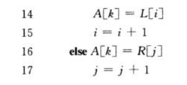
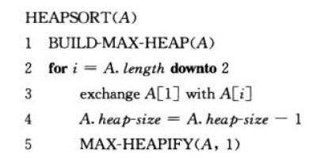
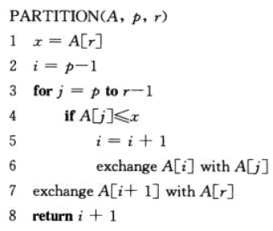

# Top Layer

## Install Emacs

### Up to date backup

github.com
完备版本的备份需要.emacs.d and .spacemacs同时存在
并且路径如下：

    .emacs.d c:/Users/Administrator/AppData/Roaming
    .spacemacs c:/Users/Administrator/AppData/Roaming

！注意，git自动上传命令缺少.spacemacs，需要手动上传

### win10安装核心解决方案

1.  !!! 需要把官网的dep库也下载下来，放到emacs/bin里面！！！用VPN下载package 这样才能有ssh等linux专用命令，才能在windows环境下连接到库
2.  核心是init.el文件，.spacemacs需要在2个user-config位置将init.el中要求的库对应添加

### 安装注意事项：

    1. 先复制.emacs.d文件夹 然后启动emacs一次
    2. 删除原本的.spacemacs文件
    3. 将备份库里面的.spacemacs文件复制到路径中
    4. 在init.el中修改emacs版本信息
    5. 安装source code pro字体
    6. 用cygwin64安装C++支持dll
    7. 安装gnutls dll添加ssh等连接远端服务区的命令

### 错误代码说明

Source Code Pro是一种字体
百度搜索安装即可

## 版本控制

### 创建不受emacs官方git管理的文件夹

1.  生成private dean layer

    M-x configuration-layer/create-layer命令，然后回答几个问题，创建dean的private layer.
    dean是layers的name,我用的是yyx
    需要编辑~/.spacemacs文件，添加dean layer (line 32 to add yyx layer)

2.  文件目录

    dean目录会出现在.emacs.d/private/dean, 里面有一个package.el文件

3.  逻辑

    1.  新建layer
    2.  将创建的layer添加到emacs的载入配置中，即添加到.spacemacs中
    3.  修改package.el进行package管理

4.  el文件提供package的逻辑

    1.  提供可载入的feature
    
        my-feature.el里面有代码如下
        
            ;; Your code goes here ...
            (provide 'my-feature)
        
        当配置文件(require 'my-feature)时，自动寻找同名.el .elc文件
    
    2.  将.el .elc文件所在路径加入环境变量
    
        (push "*some/path*" load-path)
    
    3.  启动emacs的时候的delay
    
        require是直接load所有package
        Auto-loading是当且仅当使用该package的时候才load
        
            (autoload 'some-function "some-file")
    
    4.  use-package
    
            (use-package helm) ; require
            (use-package helm
              :defer t)        ; autoload
            (use-package helm
              :defer t
              :init
              ;; Code to execute before Helm is loaded
              :config
              ;; Code to execute after Helm is loaded
              )                  
    
    5.  package.el写法
    
            <layer>-packages 比如：yyx-packages作为包的名字
            (defconst mylayer-packages
              '(
                ;; Get the package from MELPA, ELPA, etc.
                some-package
                (some-package :location elpa)
            
                ;; A local package
                (some-package :location local)
            
                ;; A package recipe
                (some-package :location (recipe
                                         :fetcher github
                                         :repo "some/repo"))
            
                ;; An excluded package
                (some-package :excluded t)
                ))      
            <layer>/init-<package>  这条语句一定要有，init package
    
    6.  layer相关el载入顺序
    
        packages.el funcs.el config.el keybindings.el
        If a package is part of the end user's dotspacemacs-additional-packages, it will also be installed. 在layer层

## 初始化配置

### 代码管理

1.  启动逻辑

    init.el 
    .spacemacs

2.  注意事项

    启动初始化包在.emacs.d文件夹里面的init.el文件中
    之后需要有.spacemacs文件与.emacs.d文件在同一路径下
    以github 包含在.emacs.d文件夹内的.spacemacs文件为准
    并将其提出来放到文件夹外面
    不要用init.el生成的.spacemacs文件作为配置
    修改init.el来添加package的时候，需要手动增加.spacemacs中的pack
    其位置为：最底部quoto后面

3.  install package最终结果

    1.  在init.el里面require
    2.  在.spacemacs 中layer函数中，additional—package中添加此package的名字

### git必备包

1.  安装git bash

    重要，这是在Windows中提供了一个cmd可用命令

2.  安装github desktop

3.  使用方法

    1.  涉及的package： magit/git-auto-commit
    
    2.  magit
    
        C-x g 打开magit模式，可以用来查看状态
    
    3.  git-auto-commit
    
        C-x p 保存文件自动commit到远端
    
    4.  详细流程
    
        功能自从更新以后不好用 打开git-auto-commit-mode之后用github desktop操作
        
            1. C-x p
            2. 操作完成后保存文件即可

## 必备操作集锦

### 不重启emacs直接生效配置方法

    C-x C-e 光标前面的运行一条语句。立即生效。
    M-x -region 选择一个 region , 
    M-x load-file ~/.emacs
    M-x eval-buffer

### 选中、复制、粘贴、查找

    Ctrl+space (从当前光标处开始选中) 注意：需要在日期与键盘中把切换输入法的快捷键解绑
    Ctrl+Shift+space (从当前光标处开始选中) 如果上一条命令不可用，临时用这个
    Ctrl+w (剪切)
    Alt+w (复制) 
    Ctrl+y (粘贴) 
    C-s 开始正向查找
    C-r 开始方向查找
    C-g 取消之前的按键（将会成为最常用的按键之一）
    C-/ 取消之前的命令

### 光标操作

    C-g g 跳转到第几行
    c-x c-s 保存当前文件
    c-v 上滚屏
    m-v 下滚屏
    c-x c-b 列出所有缓冲区/没什么用 直接用打开文件就行了
    c-x h 全选
    c-space 标记
    c-/ 撤销命令
    c-x o 切换窗口（窗口排列时切换当前窗口）
    M-m TAB一键循环切换buffer
    c-e M-b 先切换到行尾 然后按句子单位回退
    M-e M-a 换行 到指定位置 最好用的命令 以区块为单位，切换首位
    M-; 注释掉当前行
    M-m 0-9 提供于windows-numbering包 作用：当有多个buffer同时打开时，一键切换当前选中buffer

### 命令主菜单

    M-m spacemacs buffer管理
    M-x helm-command
    c-c 当前文档格式 编译菜单
    c-x 文档保存 新建等管理
    c-h 帮助

### 帮助主菜单

    c-h 主命令
    c-h a 查找关键词对应的函数
    c-h f 函数
    c-h v 变量
    c-h k 快捷键    

### 多buffer管理：

    C-x b helm-buffer-list更好用一点
    C-x C-b buffer-list
    C-x o 在窗口之间切换
    C-x 0 关闭当前窗口
    C-x 1 只显示当前窗口
    C-x 2 纵向新建窗口
    C-x 3 横向新建窗口
    M-m #number 跳转到第几个窗口    
    
    同窗口下多buffer切换（大于两个，否则可以直接M-m Tab）
    M-m b 1-9 

### 根目录Roaming打开方式及三种快速目录切换

在路径中输入

    Type ~/ 回车 进入Home路径/即Roaming
    Type / 回车 进入盘符根路径，即C:
    Type ./ 回车 进入默认路径，即在default-directory中设置的路径
    SPC f r 快速打开最近文件目录

### 设置默认文件夹

    ;; 设置默认文件夹
    (setq default-directory "c:/Users/Administrator/test/emacs")

### 补全工具选择：

ivy轻巧 极简主义

### 中文字体支持，数字加字母乱码解决方案

    (set-fontset-font "fontset-default" 'gb18030 '("Microsoft YaHei" . "unicode-bmp"))

### 删除文中多行空白行

    M-x flush-lines ^$
    Flush lines containing match for regexp:^$    

### SPC键位说明：

    SPC = M-m    

### recentf快速打开最近目录

    SPC f r

### 不重启重载配置的方法，利用SPC=M-m

    SPC f e R  只能处理.spacemacs
    M-x eval-buffer 同上
    M-x load-file init.el 可以重载任何文件

### 手写configuration文件，对于package installation

1.  使用帮助菜单，查看变量功能

2.  init.el中手写配置函数

    学习package中.el的写法
    
        (defcustom org-download-screenshot-method "gnome-screenshot -a -f %s"   "最后一个短语限定该变量的默认值"
          "The tool to capture screenshots."
          :type '(choice
                  (const :tag "gnome-screenshot" "gnome-screenshot -a -f %s")   "tag 是标签，紧跟着的是变量的实际取值"
                  (const :tag "scrot" "scrot -s %s")
                  (const :tag "gm" "gm import %s")
                  (const :tag "imagemagick/import" "import %s")
                  ;; screenshot method in ms-windows, /capture=4 stands for interactive.
                  (const :tag "IrfanView" "i_view64 /capture=4 /convert=\"%s\"")
                  ;; screenshot script in osx, -i stands for interactive,
                  ;; press space key to toggle between selection and
                  ;; window/application mode.
                  (const :tag "screencapture" "screencapture -i %s")
                  ;; take an image that is already on the clipboard, for Linux
                  (const :tag "xclip"
                         "xclip -selection clipboard -t image/png -o > %s")
                  ;; take an image that is already on the clipboard, for Windows
                  (const :tag "imagemagick/convert" "convert clipboard: %s")
                  (function :tag "Custom function")))     

### 图片显示问题 org-mode

安装缺少的.dll文件即可
首先运行C-h v image-library-alist，看看你的版本需要什么文件
在org中显示image
C-c C-x C-v org-taggle-inline-images

### 终极图片处理

1.  常规解决方案iimage-mode

        file: ./a.png 插入图片的org-mode 代码
        file:images/a.png
        M-x 运行iimage-mode可以在emacs中直接显示/隐藏图片
        #+CAPTION: 电话拨打过快过多   设置图片标题
        #+ATTR_HTML: :width 100%   设置图片尺寸：表示宽度和浏览器页面宽度相同    

2.  更好的解决方案: org-download + imagemagick

    1.  配置方法
    
        1.  安装
        
            安装org-download及imagemagick cygwin版本
            添加环境变量
        
        2.  imagemagick的使用方法及配置
        
            convert clipboard: d:/test/test.png  cmd命令行将剪切板上的图片保存为test.png
            需要在导入org-download的时候修改默认的org-download-screenshot配置
            在init.el中添加如下语句
            
                (setq org-download-screenshot-method "convert clipboard: %s")
            
            则设置了org-download-screenshot-method的默认方法为imagemagick中的convert

3.  使用方法

        M-x org-download-screenshot-methods 一键完成粘贴 剪切板中的图片，不需要保存路径
        C-S-y 绑定按键到该命令即可
        (global-set-key (kbd "C-S-y") 'org-download-screenshot)  -连接表示需要 同时按键
        或者直接将images中的文件拖动到emacs即可，需要org-download包支持    
        C-c C-x C-v 显示所插入的图片 开启org-taggle-inline-image-mode 控制开启和关闭

### 正则表达式

1.  学习链接网站

    <https://blog.csdn.net/hljqfl/article/details/86483206>
    <https://blog.csdn.net/zzllabcd/article/details/5895952>
    <https://blog.csdn.net/qq_34739497/article/details/80043208>
    <https://blog.csdn.net/wangtongxue123456/article/details/68941070>

2.  常用命令

        Emacs的正则表达式都需要转义
        例如：/(<[/]?/(li/|ul/|div/).*?>/)
        
        C-M-s  isearch-forward-regexp向前正则匹配
        C-M-r  isearch-backward-regexp向后正则匹配
        M-x    query-replace-regexp正则查询替换（对于每一次替换都要确认）
        M-x    replace-regext正则替换（直接替换全部匹配的所有，不需要确认）
        
        M-x re-builer  手动生成正则表达式
        M-x regexp-builder 同上,手动生成正则表达式
        M-x regexp-opt  根据目标内容生成对应的正则表达式
        可以利用emacs的函数exgrep-opt自动生成一个高效的正则匹配表达式：
        
        注：在elisp代码中需要用2个反斜线\\进行转义，而在minibuffer中输入时，只需要1个\进行转义
        在重复进行正则表达式操作时，可以直接用上、下光标按键，查看正则表达式的历史匹配记录

3.  正则表达式应用实例

        [a]正则搜索内容为"空格"或"<TAB>"：
        按键：C-M-s： \|<tab>
        按键说明：第1个按键为空格" "，第2个按键为"\|"是或者的意思，第3个按键为<TAB>，显示为"^I"。
        Regexp I-search: \|^I
        
        [b]正则搜索内容为"回车"：
        按键：C-M-s：C-q C-j，显示为^J
        Regexp I-search: ^J
        
        [c]正则搜索内容为“Tab制表符“：
        按键：C-M-s：<tab>，显示为^I
        Regexp I-search: ^I
        
        [d]查找IPv4格式的IP地址:
        按键：C-M-s：\\(\[0-9\]\\{1,3\\}\\.\\)\\{3\\}\[0-9\]\\{1,3\\}
        61\.139\.[0-9]\{1,3\}\.[0-9]\{1,3\}
        
        [e]正则替换IP地址：(将所有61.139.*.* 替换为1.2.3.4)
        按键：C-M-%：61\.139\.[0-9]\{1,3\}\.[0-9]\{1,3\}<RET>1.2.3.4
        Query replace regexp (default 61\.139\.[0-9]\{1,3\}\.[0-9]\{1,3\} -> 1.2.3.4:
        
        [f]正则替换：将多个空格或者TAB替换为1个空格
        按键：C-M-%：[ C-q<TAB>]+<RET> <RET>
        Query replacing [ ^I]+ with  : (? for help)
        按键：C-M-%：
        Query replace regexp (default [ ^I]+ ->  ): 
        
        [g]正则替换：将从eshell下执行的命令结果拷贝至记录文件中后，替换掉命令结果中的shell命令提示符（ /mnt/sda5d/TDDownload/shell $  替换为 shell# )
        按键：C-M-%：^/.* \$<RET>shell#<RET>
        Query replace regexp (default ^/.* \$ -> shell#): 
        
        [h]正则搜索所有"空格+行尾"（行尾以空格结束，在vim中是/ $）：
        按键：C-M-s: +$
        
        [i]正则替换：将多个空行替换为1个空行
        按键：M-x replace-regexp:^C-q C-j $<RET><RET>
        按键说明：^表示以什么开始，C-q C-j联合按键是一个回车，$表示行尾
        Replace regexp (default ^^j$ -> ):
        
        [j]正则替换：使用()()进行分组交换（将单词与冒号的组合abc:进行交换: abc）
        按键：Ｍ-x replace-regexp:\([a-z]\{1,999\}\)\(\:\)<RET>\2 \1<RET>
        按键说明：\(.....\)表示第１个分组，后面可以跟多个分组\(....\)\(.....\)在替换时分别以\1\2\3来表示之前定义的各个分组。
        
        [k]正则替换：将css文件中abc{中间加个空格abc {
        按键：M-x replace-regexp:\([a-z]+\)\({\)<RET>\1 \2<RET>
        按键说明：在\(.....\)编组之间的字符直接用字符即可，不用加上\转义
        
        [l]正则替换：将所有单词的首写字母替换为首写字母大写
        按键：M-x replace-regexp:\(\w+\)<RET>\,(capitalize \1)<RET>
        按键说明：在替换部分\,表示后面跟的不是要用来替换的东西，而是一段lisp程序
        
        [m]正则替换：将所有匹配的文字后面加上一个回车
        按键：M-x replace-regexp:\([a-z]+\)\({\)<RET>\&C-qC-j<RET>
        按键说明：在替换部分用\&表示前面匹配的所有文字
        
        [n]正则替换：将所有匹配的1 1-1 1-1-1替换为#1 #1-1 #1-1-1
        按键：M-x replace-regexp:\(\([0-9]+\-\)*[0-9]+\)<RET>#\1
        原文为：
        1
        1-1
        1-1-1
        asfa saf  232-33, 11-22-33-44
        smesf ijds  101-22-33-23
        替换后：
        #1
        #1-1
        #1-1-1
        asfa saf  #232-33, #11-22-33-44
        smesf ijds  #101-22-33-23    

4.  用法总结

        "." 一个匹配除了换行符(newline)之外任何单个字符的特殊字符 a.b
        "*" 表示某个前导表达式重复任意次 “fo*”: “f”, “fo”, “foo”
        + 匹配前导表达式至少一次的出现 “ca+r”匹配串“car”和“caaaar”，不匹配“cr”
        ? 匹配前导表达式至多一次的出现 “ca?r”仅仅匹配“car”或“cr”
        “*?, +?, ??” 当有一个紧跟着的“?”，就是是非贪心的了：将尽可能少的匹配。 匹配 “abbb”时，“ab*”将匹配全部（最长有效匹配），而“ab*?”将仅仅匹配“a” （最短有效匹配）。
        /{N/} 恰好匹配了 N 次 “x/{4/}”仅仅匹配串“xxxx”
        /{N,M/} 指定重复次数在N和M之间的后缀操作符
        [ ... ] 字符集 “[]a]” 匹配“]”或“a”  想包括“-”，它要是字符集中的第一个或最后一个字符。 或者放在一个范围的后面。如“[]-]”匹配“]”和“-” 包括字符“^”，它可以在除第一个位置以外的任何地方
        [^ ... ] 补集合 一个补集合可以匹配换行符，除非换行符被指定为补集合中的一个字符
        ^ 仅仅匹配在文本中行首的那个空串的特殊字符。就是说，“^foo”匹配在行首的 “foo”
        $ 和“^”相似，但仅匹配行尾的空串。因此“x+$”匹配在行尾的一个或多个“x” 的串      
        /｜ 或逻辑 A/|B A 或 B
        /( ... /) 分组结构，围住“/｜”的选择项，以实现别的操作
        \d [0-9]
        /D “/(.*/)/1”匹配任何有完全相同的两部分而无换行符的串 “/(.*/)” 匹配前一半，可以是任意的串，“/1”匹配后面的，但必须和前面的完全相同
        /` /' /= 匹配空串，分别对应 缓冲区开头 结尾 点（point）处
        /b 匹配空串，但仅在一个词的开始或者结尾的 例如，“/bfoo/b”匹配任何作为单 独的词出现的“foo”。“/bballs?/b”匹配作为单独的词出现的“ball”或 “balls”。
        /B 匹配空串，但不在词的开始或结尾处
        /< 匹配空串，但仅在词的开始处。仅当一个构成词的字符在缓冲区开始处时“/<” 匹配缓冲区开始处的空串。
        /> 匹配空串，但仅在词的结尾处。仅当缓冲区尾部有构成词的字符时“/>”匹配缓 冲区尾部的空串。
        /w 匹配任何构成词的字符。由语法表决定这些字符是什么。等效于[a-zA-Z0-9_-]
        /W 匹配任何非构成词的字符。
        /s 匹配空白字符，包括制表符、换行符、回车符和空格符
        \S 匹配非空白字符
        /sC 匹配任何语法是 C 的字符。这里 C 是一个指定特定语法类的字符：如“w”为词 的构成字符，“-”或“ ”为空白，“.”为普通标点符号，等等。
        /SC 匹配任何字符不属于语法 C。
        /cC 匹配任何属于种类 C 的字符。例如，/cc匹配汉字，/cg匹配希腊字符等。 如果想了解已知种类，用M-x describe-categories 。
        /CC 匹配所有不属于种类C的字符。
        在正则表达式中有3种类型的括号:方括号 [和花括号{ 。方括号"["内是需要匹配的字符，花括号"{"内是指定匹配字符的数量。圆括号( 则是用来分组的。
        注意：[0-9]{8} 与 ^[0-9]{8}$的用法，后者可以限定了子串匹配只包含0-9
        注意：可以用单个字符来精准匹配， 但是如果有多个字符需要同时匹配，则需要加上[]括号集 正则表达式一定要用[]来定义字符取值集合
        注意：只有搜索语句可以用正则表达式，替换语句必须精准
        此外：slips语言中需要加上/来转义，但是minibar中的正则替换命令不需要转义
        前瞻：
        exp1(?=exp2) 查找exp2前面的exp1
        后顾：
        (?<=exp2)exp1 查找exp2后面的exp1
        负前瞻：
        exp1(?!exp2) 查找后面不是exp2的exp1
        负后顾：
        (?<!=exp2)exp1 查找前面不是exp2的exp1
        这四个概念用来处理删除操作比较合适，即保留某个exp表达式，括号内为需要保留的内容
        
        贪婪与非贪婪模式
        .* 贪婪模式 尽可能多的匹配
        .*? 非贪婪模式，第一次匹配到就结束匹配

5.  测试

    正则表达式测试工具
    <https://c.runoob.com/front-end/854>
    
        asadfjlsdjflsb sadflkjsdal sadfjl
        c.b
        
        c.d cdd
        abbcdd abb cdd      

### undo-redo undo-tree

    C-x u 进入 undo-tree-visualizer-mode ,
    p n   上下移动，
    b f    在分支左右切换，
    t 显示时间戳，选定需要的状态后，
    q 退出。    

### 大小写转换

1.  改变选定区域的大小写

        C-x C-l (downcase-region)	选定区域全部改为小写
        C-x C-u (upcase-region)	选定区域全部改为大写    

2.  从光标开始，处理单词后半部分

        M-c (capitalize-word)	首字母改为大写
        M-u (upcase-word)	全部改为大写
        M-l (downcase-word)	全部改为小写

3.  从光标位置开始，处理单词前半部分

        M– M-c	negtive-argument; capitalize-word
        M– M-u	negtive-argument; upcase-word
        M– M-l	negtive-argument; downcase-word

### 快速打开init.el文件的方法

可以再init.el中简单的配置命令,然后按F2就可以了

    ;; 快速打开配置文件
    (defun open-init-file()
      (interactive)
      (find-file "~/.emacs.d/init.el"))
    ;; 这一行代码，将函数 open-init-file 绑定到 <f2> 键上
    (global-set-key (kbd "<f2>") 'open-init-file)

### 设置emacs为默认全屏打开

代码

    (setq initial-frame-alist (quote ((fullscreen . maximized))))

### 取消每次打开.py文件都要询问一次是否载入python layer

(add-to-list 'auto-mode-alist '("\\\\.py?\\\\'" . python-mode))

### 设置emacs默认的python版本，cmd输入python打开的版本

1.  emacs eshell默认python

    (setq python-python-command "d:/anaconda/python.exe")

2.  cmd默认python

    1.  如果缺少dll包
    
        只需要安装官网版本的python3.7即可，不用添加环境变量，用anaconda中的python.exe+官网Python的dll即可
    
    2.  识别python命令及设置默认python
    
            which python 可以查看当前python的路径和版本
            将"d:/anaconda"中的python添加到系统变量并且放到emacs/bin/python.exe的前面即可
            先后顺序决定了优先使用哪个python.exe    

### 设置jupyter notebook的默认启动路径

1.  打开cmd，首先进入到Jupyter的安装目录，我的是在D:\Python\Anaconda\Scrips中。然后，输入命令“jupyter notebook &#x2013;generate-config”
2.  找到#c.NotebookApp.notebookdir =' '，删掉开头的“#”，在‘ ’中输入你要启动的目录路径
3.  c.NotebookApp.notebookdir = 'd:/github/codetest/python'

# Emaces Usful Command

## Command

### 常用命令

    cmd --insecure 模式打开emacs才能有网络连接
    cmd --insecure 用Texlive GUI command-line打开emacs之后默认用texlive编译.tex
    c-x c-s 保存当前文件
    m-x list-package 列出所有package
    c-x o 切换窗口
    m-> 文档底部
    m-< 文档开头
    c-v 上滚屏
    m-v 下滚屏
    c-x c-b 列出所有缓冲区/没什么用 直接用打开文件就行了
    c-x h 全选
    c-space 标记
    c-@     标记
    c-/ 撤销命令
    c-_ 撤销命令
    M-m 打开spacemacs主菜单
    M-m TAB一键循环切换buffer
    c-e M-b 先切换到行尾 然后按句子单位回退
    M-e M-a 换行 到指定位置 最好用的命令
    M-; 注释掉当前行
    M-m 0-9 提供于windows-numbering包 作用：当有多个buffer同时打开时，一键切换当前选中buffer
    M-x eshell 打开命令行工具

### 命令主菜单

    M-m spacemacs buffer管理
    M-x helm-command
    c-c 当前文档格式 编译菜单
    c-x 文档保存 新建等管理
    c-h 帮助

### 帮助

    c-h 主命令
    c-h a 查找关键词对应的函数
    c-h f 函数
    c-h v 变量
    c-h k 快捷键

## 一些解决方案

### 多buffer管理：

先分屏 后打开buffer

    C-x 0 关闭当前窗口
    C-x 1 只显示当前窗口
    C-x 2 纵向新建窗口
    C-x 3 横向新建窗口
    M-m #number 跳转到第几个窗口

以上几个快捷键就够用了

### 任意文件同一个窗口打开

    C-x C-f 打开文件的命令，
    type ~/然后回车 直接打开根目录

### 快捷跳转行数

    M-g g 跳转到第几行  需要设置显示行数功能

### 设置在左侧显示行数功能

1.  绑定按键及配置文件

        spacemacs build in function
        C-x t 绑定按键到M-x linum-mode
    
    绑定按键的配置文件 修改init.el文件
    
        ;; global-set-key
        ;;
        ;; set linum-mode
        (global-set-key (kbd "C-x t") 'linum-mode)

2.  特别注意需要linum-relative package的支持

    在.spaces中初始化才能startup载入

3.  可以直接搜索变量 C-h v 然后配置变量

    好处是，可以通过UI界面来配置初始化变量

### 复制粘贴及矩形区域选择解决方案

1.  利用expand region的快捷键

        M-m v 标记并可以调整区域

2.  利用C-x C-x 瞬间交换光标的位置与开头或者结尾

    完美！解决！

### 笔记，保存及预览设置

1.  目前最优方案

    导出为html文件
    
    在github上面用readme预览

2.  注意事项

    需要刷新

### 在org mode里面插入图片，并且可以选择直接在本文文档中查看图片

    首先，把图片文件放入当前路径中
    接着用file:decom.png 格式在org中插入图片
    #+CAPTION: 电话拨打过快过多 设置图片格式
    #+ATTR_HTML: :width 100%  设置图片宽带，为当前浏览器的100% 此例中
    最后可以用M-x iimage-mode 选择打开minor mode 来查看所插入的图片

## Spacemacs

### Spacemacs 配置文件 添加package cuda-mode

添加该段代码到.spacemacs.el文件中的合适位置

    ;; add packages 
    ;;
    (defun dotspacemacs/layers ()
      "Configuration Layers declaration."
      (setq-default
       ;; ...
       ;; List of additional packages that will be installed wihout being
       ;; wrapped in a layer. If you need some configuration for these
       ;; packages then consider to create a layer, you can also put the
       ;; configuration in `dotspacemacs/config'.
       ;; add packages
       dotspacemacs-additional-packages '(
                                          cuda-mode
                                          company
                                          )
       ;; ...
       ))
    
    (defun dotspacemacs/config ()
      "Configuration function.
    This function is called at the very end of Spacemacs initialization after
    layers configuration."
      ;; add packages
      dotspacemacs-additional-packages '(
                                         cuda-mode
                                         company
                                         )
      ;; 
      )

### Spacemacs 配置文件 初始化init.el文件 使所有buffer默认打开company模式

    ;; Enable global company mode
    (require 'company)
    (add-hook 'after-init-hook 'global-company-mode)
    (setq company-idle-delay 0.1)
    (setq company-minimum-prefix-length 1)
    (setq company-backends '((company-capf company-files company-elisp company-inf-ruby company-anaconda company-go company-irony company-clang company-cmake company-css company-yasnippet) (company-dabbrev company-dabbrev-code)))

## Company 自动补全包 命令集

    M-n M-p select
    Enter: to complete 
    C-s, C-r and C-o: Search through the completions with 
    M-(digit) to quickly complete with one of the first 10 candidates.

## Expand-region 快捷键文本选中 package

    M-m v 选中当前光标所在的单词，继续按v则扩大选区 V则缩小选区 具体命令见下方说明

## Magit package自动上传本地文档到github

    C-x g 已通过global-set-key自定义绑定 键位 到命令magit-status

在新打开的magit窗口中（通过magit-status命令）

    s 小写s表示git add命令
    c 表示commit命令
    但以上两个步骤已经通过git-auto-commit自动commit过了
    P u 大写P表示push命令

## Git-auto-commit 每次保存文件自动commit到github 需要在.spaces中初始化才能startup载入

### 配置步骤

需要两步：

1.  unsigned 需要在.spaces中初始化才能startup载入 add package
2.  gac-automatically-push-p 当变量不为0时，还可以自动push！！！！ 在package里面customize这个变量即可
3.  绑定按键 C-x p 自动commit+push
4.  下载下来package之后， 需要运行 M-m ! 打开shell窗口配置github
5.  显示信息: minor mode窗口会有gac标志

    git config --global user.email yyang181@github.com

### 使用方法

当且仅当 处理单个文件的编译时，想要多次一键测试结果 可以开启 gac-mode,也即git-auto-commit-mode

快捷键

    C-x p 打开gac模式，使得保存文件之后自动commit push

### 按键配置代码 init.el文件

    ;; global-set-key
    (global-set-key (kbd "C-x p") 'git-auto-commit-mode)

## Evil-nerd-commenter Package

### 配置步骤

unsigned 需要在.spaces中初始化才能startup载入

需要在init.el中配置默认按键

    ;; set up default hotkeys for evilnc
    ;;
    ;; evil-nerd-commenter
    (evilnc-default-hotkeys)

设置按键

    (evilnc-default-hotkeys) 使用默认按键

### 使用方法

    C-u number M-; 注释从当前行开始的 number 行

## Flycheck

### 配置方法

package unsigned 需要在.spacemacs中配置

To enable Flycheck add the following to your init file:

    (add-hook 'after-init-hook #'global-flycheck-mode)

需要设置变量的值来激活

    C-h v type flycheck-check-syntax-automatically
    把这个变量的值修改即可

## Git 综述

结合两个package完美一键push到github

-   git-auto-commit: 保存当前文件时自动commit
-   magit: s打开magit status界面
-   magit: P u 一键push到github
-   前提条件是配置了git config &#x2013;global
-   大量文件跟更改可以直接用git desktop
-   单文件修改调试可以用此文中的快捷键方法

## 神器：global-set-key自定义绑定 键位 到命令

### 方法一 修改init.el文件

    ;; global-set-key
    (global-set-key (kbd "C-x g") 'magit-status)

### 方法二 可能会出现单次设置单次使用

    M-x global-set-key 
    type 需要绑定的键位 并按enter确认
    type 需要绑定的命令 并按enter确认

## 重要：配置private layer:yyang181

### 优先使用.spacemacs文件，如果没有，使用init.el文件生成.spacemacs

### 只修改两个文件init.el 和.spacemacs

### 设置users layer .spacemacs

    (setq-default dotspacemacs-configuration-layers
      '(
        ;; other layers
        ;; rms layer added at the end of the list
        yyang181
      ))

### .spacemacs文件

1.  设置users layer .spacemacs

        (setq-default dotspacemacs-configuration-layers
          '(
            ;; other layers
            ;; rms layer added at the end of the list
            yyang181
          ))

2.  配置layers variables

    1.  方法一
    
        例子
        
            (defun dotspacemacs/layers ()
              ;; List of configuration layers to load.
              (setq-default dotspacemacs-configuration-layers
                '(auto-completion
                  (git :variables
                       git-magit-status-fullscreen t
                       git-variable-example nil)
                  smex)))
        
        代码解释
        
            auto-completion 是layer名称
            git 是package名称
            :variables 表示配置variables
            git-magit-status-fullscreen 等是变量名 及变量value
    
    2.  方法二
    
            dotspacemacs/user-init 在这个函数中配置variables

3.  禁止package在其他layer的使用

    1.  代码
    
            (defun dotspacemacs/layers ()
              ;; List of configuration layers to load.
              (setq-default dotspacemacs-configuration-layers
                '(org git
                  (auto-completion :disabled-for org git))))
    
    2.  解释
    
        只用看最后一行
        
            '(org git
                  (auto-completion :disabled-for org git)))) 表示在org和git这两个layer中禁用了auto-complete

4.  允许package在其他layer的使用

    1.  :enabled-for 其他同上

5.  允许或者禁用layer的package

        (defun dotspacemacs/layers ()
          ;; List of configuration layers to load.
          (setq-default dotspacemacs-configuration-layers
            '(auto-completion
              (spacemacs-ui-visual :packages (not neotree fancy-battery))))
    
        (defun dotspacemacs/layers ()
          ;; List of configuration layers to load.
          (setq-default dotspacemacs-configuration-layers
            '(auto-completion
              (spacemacs-ui-visual :packages (not neotree fancy-battery))))

6.  Global line numbers

        (setq-default dotspacemacs-line-numbers t)

## Configuration Layers

### 可以检查其他人的layer里面的文件来学习使用方法

### 结构

    [layer_name]
      |__ [local]
      | |__ [package 1]
      | |     ...
      | |__ [package n]
      |-- layers.el
      |__ packages.el
      |__ funcs.el
      |__ config.el
      |__ keybindings.el
    
    [] = directory

### layer中各种文件的作用

    layers.el
    The place to declare additional layers
    packages.el
    The list of packages and their configuration functions (init, post-init, etc…)
    funcs.el
    All functions defined in the layer (used in package configuration for instance)
    config.el
    Layer configuration (defines the layer variables default values and setup some config variables)
    keybindings.el
    General key bindings no tied to a specific package configuration

    Packages can be:
    ELPA packages installed from an ELPA compliant repository
    local packages in a layer’s local folder
    installed from an online source using quelpa.

### 配置packages

1.  声明packages

    1.  官方文件的方法
    
            (setq <layer>-packages '(package1 package2 ...)
    
    2.  本地packages文件的方法
    
            (defconst yyang181-packages
              '()
              "The list of Lisp packages required by the yyang181 layer.

2.  初始化packages

    1.  官方说明
    
            (defun <layer>/init-xxx () ...body )
    
    2.  配置例子
    
            (use-package color-moccur
              :commands (isearch-moccur isearch-all)
              :bind (("M-s O" . moccur)
                     :map isearch-mode-map
                     ("M-o" . isearch-moccur)
                     ("M-O" . isearch-moccur-all))
              :init
              (setq isearch-lazy-highlight t)
              :config
              (use-package moccur-edit))
            
              :init
              (add-hook 'prog-mode-hook #'ace-jump-mode)
              (add-hook 'text-mode-hook #'ace-jump-mode))
            
              :custom
              (comint-buffer-maximum-size 20000 "Increase comint buffer size.")
              (comint-prompt-read-only t "Make the prompt read only."))
    
    3.  尽可能放到:config里面 不要放到：init里面，为了加快启动速度
    
    4.  自动安装到系统
    
            :ensure t
    
    5.  自动删除旧版更新命令
    
            :config
            (setq auto-package-update-delete-old-versions t)
            (setq auto-package-update-hide-results t)
            (auto-package-update-maybe)

## 终极解决方案

### 优先在init.el文件中处理包

### 步骤：在init.el文件中导入package 并且配置即可

### 例子

1.  elpy package

    1.  网址链接
    
        <https://elpy.readthedocs.io/en/latest/ide.html#interpreter-setup>
    
    2.  init.el文件中添加的源代码
    
            (require 'elpy)
            (setq python-shell-interpreter "jupyter"
                  python-shell-interpreter-args "console --simple-prompt"
                  python-shell-prompt-detect-failure-warning nil)
            (add-to-list 'python-shell-completion-native-disabled-interpreters
                         "jupyter")

## web浏览器 w3m

### 配置

<https://github.com/venmos/w3m-layer/blob/master/READMECN.org>
下载cygwin 用类Unix工具将w3m安装包转为win api文件
安装w3m
配置emacs并使用

### effective operation

按照linux安装w3m的步骤，在cygwin中操作实现
两个package需要安装，w3m和emacs-w3m

### 一定要配置w3m emacs-w3m两个package在cygwin中

cygwin中安装完成之后，windows系统中自动包含了所需的package

### 需要配合cygwin一起使用！

### 快捷键

    SPC a w o	打开链接
    SPC a w f	打开文件
    SPC a w s	使用 Google 搜索
    SPC a w b	用 helm 打开书签    

### 键位绑定

    o	Ace-link
    w p	使用 MPV 播放 Youtube 与 Blibli
    w y	拷贝光标处链接
    w f	打开文件
    w o	打开链接
    w O	在新标签中打开链接
    w t	打开光标处链接到新标签
    w T	打开新的空白标签
    w s	使用 Google 搜索
    w S	在新标签中搜索
    w l	下一个标签页
    w h	上一个标签页
    w d	保存页面为文本文件
    w D	保存页面为 HTML
    w x	关闭标签
    w a	添加到收藏夹
    w b	用 helm 打开收藏夹
    w B	用 w3m 收藏夹
    w e	编辑收藏夹
    w m	使用外部游览器打开链接
    q	挂起 W3M
    Q	退出 W3M
    B	返回
    N	前进
    H	打开默认主页
    R	刷新
    C-f	向下移动一页
    C-b	向上移动一页    

### 可用的快捷键-一定要注意大小写

    C-x-k ： 关闭当前标签页
    U ： 打开URL
    V ： 打开文件
    G ：在标签页打开一个网址
    S ： 用google进行搜索
    B ： 后退
    N： 前进
    H ： 主页
    RET ： 打开连接
    页面操作
    　　C-n   向下一行
    　　C-p   向上一行
    　　C-b   向后
    　　C-f   向前
    　　C-v   向下滚屏
    　　M-v   向上滚屏
    　　>       向右滚
    　　<       向左滚
    　　，      向左滚一格
    　　.        向右滚一格
    书签
    　　a: 添加到当前页到书签
    　　M-a : 添加该url到书签
    　　v: 显示书签
    　　E : 编辑书签
    　　C-k : 删除书签
    　　C-_: 撤销书签
    使用百度，google搜索
    　　这个就是到搜索框，会提示TEXT，敲完之后，enter进行搜索
    其他重要操作
    　　M : 用外部默认浏览器打开当前页
    　　ESC M : 用外部浏览器打开链接
       C-c C-c: 搜索框输入text之后 转到
    　　C-c C-k ：停止载入

### github上面的推荐配置：

    (defun dotspacemacs/user-config ()
      (setq w3m-home-page "https://www.google.com")
      ;; W3M Home Page
      (setq w3m-default-display-inline-images t)
      (setq w3m-default-toggle-inline-images t)
      ;; W3M default display images
      (setq w3m-command-arguments '("-cookie" "-F"))
      (setq w3m-use-cookies t)
      ;; W3M use cookies
      (setq browse-url-browser-function 'w3m-browse-url)
      ;; Browse url function use w3m
      (setq w3m-view-this-url-new-session-in-background t)
      ;; W3M view url new session in background
    )    

### 自用配置 有错误 备用

    ;;set location                            
    (add-to-list 'exec-path "D:/w3m")
    ;; web浏览器w3m
    (require 'w3m)
    (require 'mime-w3m) 
    ;; 设置主页 
    (setq w3m-home-page "http://www.baidu.com") 
    ;; 设置显示图片
    (setq w3m-default-display-inline-images t)
    (setq w3m-default-toggle-inline-images t)
    ;; 显示图标  
    (setq w3m-show-graphic-icons-in-header-line t) 
    (setq w3m-show-graphic-icons-in-mode-line t)
    ;; 启用cookie  
    (setq w3m-use-cookies t)
    ;; 设定w3m运行的参数，分别为使用cookie和使用框架 
    (setq w3m-command-arguments '("-cookie" "-F"))
    ;; Browse url function use w3m
    (setq browse-url-browser-function 'w3m-browse-url)
    ;; W3M view url new session in background
    (setq w3m-view-this-url-new-session-in-background t)

## web浏览器eww Windows可用

### 配置

emacs中自带有eww库，可以用M-x eww测试
但是需要下载libxml2支持
xmlsoft官网下载win32版本的库即可
共需四个Dll 放到emacs/bin目录即可
libxml2-2.dll  libiconv-2.dll  liblzma-5.dl  zlib1.dll
将下载下来的整个文件夹添加到环境变量中即可

### 快捷键

    q	eww-quit	退出eww
    g	eww-reload	重载该页面
    w	eww-copy-page-url	拷贝当前URL到kill ring
    d	eww-download	下载光标所在的URL,下载的目录存在变量`eww-download-directory`中,默认为~/Downloads
    l	eww-back-url	回退上一个URL
    r	eww-forward-url	前进到下一个URL
    H	eww-list-histories	显示浏览历史
    b	eww-add-bookmark	加书签
    B	eww-list-bookmarks	显示书签列表
    &	eww-browse-with-external-browser	使用外部浏览器打开当前浏览的URL,外部浏览器由变量`shr-external-browser`决定
    v	eww-view-source	查看页面源代码
    C	eww-cookie-list	列示Cookie    

原地址：<https://blog.csdn.net/MathaDora/article/details/79468528> 

## cygwin linux系统模拟

### cygwin是什么

提供从unix到windows的应用软件移植
unix与linux的区别
gbd makefile 

### 安装

需要把c:/cygwin/bin添加到环境变量

### 基本操作

    DF 直接查看下本地驱动器
    cd /cygdriver/d 打开D盘     
    cd D: 打开D盘

### 技巧

确认这几个包是否有,对于w3m库
cvs
autoconf
libgc-dev
libncurses5-dev

### package installation methods

1.  利用cygwin的setup安装包可以补充安装package

    alias cyg-get="/cygdrive/d/path/to/cygwin/setup-x8664.exe -q -P"
    alias cyg-get="/cygdrive/c/Users/Administrator/downloads/programs/setup-x8664"

2.  之后可以用cyg-get + package 直接安装想要的package了

    例如
    cyt-get w3m

### package installation methods New version

1.  更换镜像路径为：

    <http://mirrors.163.com/cygwin/>

2.  按照教程操作

    <https://blog.csdn.net/lee244868149/article/details/52830968>

3.  安装apt-cyg包的方法（用来安装库）

        wget https://raw.githubusercontent.com/transcode-open/apt-cyg/master/apt-cyg
        mv apt-cyg /bin/apt-cyg   then place it in a /bin folder on your path:
        chmod +x /bin/apt-cyg  and make it executable:
        
        Example use of apt-cyg:
        apt-cyg install nano

### 安装w3m emacs-w3m的技术细节

1.  详尽说明网址

    <https://blog.csdn.net/lishuo_OS_DS/article/details/8069355#sec-1-2>

2.  解决autoconf 报错: autom4te版本匹配即可

    autoconf-2.69 替换掉autoconf命令

3.  解决make: cask: command not find问题

    安装cask包在cygwin中
    
        curl -fsSL https://raw.githubusercontent.com/cask/cask/master/go | python     

4.  ./configure -with-xwidget

    该命令是在emacs-w3m文件夹中执行的
    该文件夹中有configure文件

## Smex 让输入命令变得飞快

### 配置：

1.  To auto-start Smex every time you open Emacs add these lines to your .emacs file:

        (require 'smex) ; Not needed if you use package.el
        (smex-initialize) ; Can be omitted. This might cause a (minimal) delay
        ; when Smex is auto-initialized on its first run.    

2.  Bind some keys:

        (global-set-key (kbd "M-x") 'smex)
        (global-set-key (kbd "M-X") 'smex-major-mode-commands)
        ;; This is your old M-x.
        (global-set-key (kbd "C-c C-c M-x") 'execute-extended-command)

3.  使用方法

        C-s/C-r switches to the next/previous match. Enter executes the selected command.
        M-x smex
        M-X smex-major-mode-commands  runs Smex, limited to commands that are relevant to the active major mode.
        C-h f, while Smex is active, runs describe-function on the currently selected command.
        M-. jumps to the definition of the selected command.
        C-h w shows the key bindings for the selected command. (Via where-is.)
        smex-show-unbound-commands shows frequently used commands that have no key bindings
        smex-history-length to change the number of recent commands that Smex keeps track of.

## web浏览器Xwidget & 附带安装pdf阅读器

### 解决not compiled问题

<https://emacs.stackexchange.com/questions/27293/your-emacs-does-not-come-with-xwidget-support-windows-10>

## PDF阅读器

n\*\*\* Doc-view-mode

1.  安装方法

    在cygwin中用apt-cyg安装Ghostscript和xpdf包，之后即可正常使用

2.  快捷键

        p/n	上下翻页
        +/-	缩放
        C-s	搜索
        q	退出     

3.  书签功能

    利用emacs自带的package Bookmarks
    
        C-x r m	设置书签
        C-x r b	跳转到书签
        C-x r l	列出所有书签
        M-x bookmark-delete	删除书签

# Latex 编辑命令

## 平台搭建

### TeXLive + Emacs + AUCTex + SumatraPDF

### 通过清华镜像安装textlive

安装成功之后包含有：xpdf/pdfTex
需要添加到环境变量，之后emacs才能在任何cmd中调用latex命令

### 通过elpa emacs package管理工具安装AUXTex

否则无法编译导出pdf文件

### 安装auctex package

1.  source code 在init.el中设置auctex

        ;; 所有关于latex导出pdf的设置
        (require 'auctex)
        (require 'cdlatex)
        ;; (load "auctex.el" nil t t)  ;; 从elpa导入的包不需要本命令
        ;; (load "preview.el" nil t t)
        (add-hook 'LaTeX-mode-hook #'LaTeX-install-toolbar)
        (add-hook 'LaTeX-mode-hook 'turn-on-reftex) ; with AUCTeX LaTeX mode
        (add-hook 'latex-mode-hook 'turn-on-reftex) ; with Emacs latex mode
        (setq TeX-auto-save t)
        (setq TeX-parse-self t)
        (setq-default Tex-master nil)
        (setq TeX-global-PDF-mode t TeX-engine 'xetex)
        ;; 设置默认编译命令
        (add-hook 'LaTeX-mode-hook
                  (lambda()
                    (add-to-list 'TeX-command-list '("XeLaTex" "%`xelatex%(mode)% %t" TeX-run-TeX nil t))
                    (setq TeX-command-default "XeLaTex")
                    ))
        ;; (add-hook 'LaTeX-mode-hook (lambda () (add-to-list 'TeX-command-list '("XeLaTeX" "%`xelatex%(mode)%' %t" TeX-run-TeX nil t)))
        ;; (add-hook 'LaTeX-mode-hook (lambda () (setq TeX-command-default "XeLaTex")))
        ;; 将cdlatex设置为AUCtex的辅模式
        (add-hook 'LaTex-mode-hook 'turn-on-cdlatex)

2.  在.spacemacs中添加auctex到package中

3.  修改elpa自动下载下来的auctex.el文件

    如果没有这一步，会报错找不到auctex feature
    一般来说feature是由同名feature.el提供，并在结尾有
    (provide 'feature)
    因此，修改文件即可

4.  需要修改init.el中的语句

    auctex-12.1.1库中只有preview.el文件

## auctex/preview使用方法

### auctex

1.  latex编写的过程中快速插入快捷键

    1.  环境、宏插入
    
            C-c C-s 插入章节 
            C-c C-e 插入 LaTex 环境  例如：回车之后输入equ，则自动生成公式环境
            C-c C-j 插入列表 item 
            C-c ] 闭合 LaTeX 环境 
            C-c C-m 插入 Tex 宏      
    
    2.  字体改动
    
            C-c C-f C-b 插入粗体文本 
            C-c C-f C-i 插入斜体文本 
            C-c C-f C-e 插入强调文本 
            C-c C-f C-s 插入微斜体文本 
            C-c C-f C-r 插入罗马体文本 
            C-c C-f C-f 插入无衬线体文本 
            C-c C-f C-t 插入打印机体字体 
            C-c C-f C-c 插入小型大写文本 
            C-c C-f C-d 删除字体信息 

### preview-latex

    C-c C-p C-p  preview-at-point 对当前环境进行预览 重复命令取消 
    C-c C-p C-e  preview-environment    
    C-c C-p C-s  preview-section
    C-c C-p C-r  preview-region
    C-c C-p C-b  preview-buffer
    C-c C-p C-d  preview-document
    C-c C-p C-c C-p preview-clearout-at-point
    ...取消命令同上
    C-c C-k      LaTeX/TeX Output/Kill Job

## 导出pdf

### 编译方法

需要先编译

    C-c C-c 编译latex文件
    之后打开pdf即可

### 使用XeLaTex工具导出PDF

1.  两个工具都可以

    pdfTex
    XeLaTex

2.  中文支持 此方法只在XeLeTex导出模式起效

    1.  方法一 不推荐
    
        需要把头文件更换为ctexart
        
            \documentclass{ctexart} 支持中文
            \documentclass[11pt]{article} 默认
    
    2.  方法二 推荐
    
        只需要添加ctex库即可，必须使用XeLaTex导出
        
            \usepackage[UTF8]{ctex}

3.  中文支持需要针对textlive层面操作

### 可选解决方案：

1.  使用默认编译工具：

    C-c C-c 用xelatex编译

2.  安装latex-preview-pane

    正常安装方法
    此外，默认的导出pdf方式为pdflatex
    一定要在latex-preview-pane.el中把所有字符串pdflatex替换为xelatex
    需要配合pdf阅读器使用，doc-view-mode

3.  实时启动包

        M-x latex-preview-pane-mode
        (latex-preview-pane-enable) 配置init.el 全局启动该package     

4.  键位绑定

        Refresh Preview (bound to M-p)
        Open in External Program (Bound to M-P)
        Disable LaTeX Preview Pane (turns the mode off, you can also use M-x latex-preview-pane-mode to toggle it off.
        Customize LaTeX Preview Pane (opens a customization buffer where you can set the command to use for generating previews)     

### 终极解决方案：auctex package

C-c C-c 编译生成pdf
C-c C-v 直接查看生成的pdf文件
完美

## 中文环境包

    % 中文支持包
    \usepackage{ctex}
    \usepackage{CJK}
    
     % 调用环境变量 
     \begin{CJK}{UTF8}{song}
     some content here.
     具体内容
     \end{CJK}

## latex编辑公式

### 博客资源：如何写公式

1.  符号

    <https://blog.csdn.net/garfielder007/article/details/51646604>
    <https://blog.csdn.net/fansongy/article/details/45368915>

2.  环境设置

    <https://www.cnblogs.com/Sinte-Beuve/p/6160905.html>
    <https://blog.csdn.net/u011826404/article/details/70215074>

3.  在sharelatex中测试代码

    <https://cngg584.sharelatex.com/project/5ae1028219ebac1fe344cc04>

### 公式环境

1.  插入公式

        $ $ 之间写公式 直接在文中加入
        \[ \] 另起一行写公式
        \begin{equation} 需要对公式进行编号
        \end{equation}  需要对公式进行编号

2.  多个公式组

        \begin{align*}
        2x^5+2(y-3)(z-1) & =x^3+3(x^5-3y+3z-2)\\
        &=2x+5x^5-6y*4+5z-3\\
        &=5x^5+3y^2+z
        \end{align*}
        %可以看到，在align中像表格一样用&来区分每一列 用\\来区分每一行，注意到在align中并不需要使用将
        %公式转化为数学模式的符号$或者\[\]，因为它已经默认在数学模式下编辑

### 公式符号

1.  常用西文符号

    <https://blog.csdn.net/xxzhangx/article/details/52778539>

2.  上标和下标

        $$\sum_{i=1}^{n} a_i=0$$

3.  公式中加上文本 \mbox{txt}

        $$\mbox{对任意的$x>0$}, \mbox{有 }f(x)>0. $$

4.  标号 运算符

    <https://blog.csdn.net/garfielder007/article/details/51646604>
    <https://blog.csdn.net/u011826404/article/details/70215074>

5.  括号

    小括号 中括号直接用 大括号需要转译
    
        \{1+2\}
        {1+2}

6.  空格

        \;

7.  矩阵

        $$\begin{matrix}…\end{matrix}$$，使用&分隔同行元素，\\换行

8.  特殊符号的写法

    1.  下面这些是保留字符，有特殊用处
    
    2.  转译字符为反斜杠 \\
    
    3.  反斜杠比较特殊 \\
    
            $\backslash$
    
    4.  两个反斜杠为换行
    
            双引号是特殊符号， 两个tab上面的符号为前双引，两个单引号为后双引
    
    5.  文件夹//表示打开该文件夹
    
            images//1.png

9.  特殊符号的写法汇总整理

    1.  最重要的符号是反斜杠\\
    
        1.  单个反斜杠\\表示转译
        
        2.  两个反斜杠\\\\表示换行
        
        3.  要在文本中输入反斜杠\\ 需要引用公式中的符号\(\backslash\)
        
                $\backslash$
    
    2.  斜杠符号 用于latex语言中的路径分隔 以及作为数学中的除号
    
        1.  路径分隔
        
                images//1.png
        
        2.  除号
    
    3.  单引号 双引号的表示 很特殊
    
            `需要输入的内容' 前单引号为tab上方的按键 后单引号为enter左边的按键
            ``需要输入的内容双引号'' 双引号为单引号情形的两个即可 
    
    4.  矩阵的中括号
    
            \left[
                 中间部分为需要括起来的内容
            \right]
    
    5.  矩阵的写法
    
            \begin{matrix}
               1 & 2 & 3 \\
               4 & 5 & 6 \\
               7 & 8 & 9
              \end{matrix}
    
    6.  分数的写法
    
            \frac{分子}{分母}
    
    7.  省略号
    
            \cdots 水平方向省略号
            \vdots
    
    8.  不等号
    
            \neq
            \leqslant
            \geqslant
    
    9.  无穷大
    
            \infty

### 其他还有一些数学环境里的「要」和「不要

    用 $ ... $ 而不用 \( ... \)；
    用 align 环境而不用 eqnarray 环境；
    用 matrix, bmatrix, pmatrix, vmatrix, Vmatrix 等环境而不用 array 环境去实现矩阵；
    用 \bigl, \bigr 等命令来处理定界符，而尽可能避免 \left 和 \right。
    换行 优先用\\换行符，因为空一行来换行的话会出现开头自动tab的问题
    空出一行 可以用 \vbox{}\\
    最后一行一定不能有\\ 并且空行跟换行符\\不能同时用

## latex 设置字体格式

### 设置字体大小

1.  第一种方法

        \fontsize{字体尺寸}{行距}

2.  第二种方法 从小到大

        Command     Nominal Point Size      Exact Point Size
        \tiny               5                       5
        \scriptsize         7                       7
        \footnotesize       8                       8
        \small              9                       9
        \normalsize        10                      10
        \large             12                      12
        \Large             14                   14.40
        \LARGE             18                   17.28
        \huge              20                   20.74
        \Huge              24                   24.88
        
        \tiny
        \scriptsize
        \footnotesize
        \small
        \normalsize 采用默认！
        \large
        \Large
        \LARGE
        \huge
        \Huge

### 设置字体颜色

    \usepackage{xcolor}
    \textcolor{color}{words to be in color}
    \color{color}{}
    \colorbox[rgb]{r,g,b}{text}  %背景颜色

### 设置字体居中

    \centerline{\large{Homework 1}}

### 设置字体加粗 下划线等命令

1.  命令汇总

        \usepackage{ulem}
        
        \uline{text}  下划线
        \uuline{text}  双下划线
        \uwave{text} 波浪线
        \sout{text} 删除线
        \xout{text} 斜删除线
        
        显示直立文本： \textup{文本}
        意大利斜体： \textit{文本}
        slanted斜体： \textsl{文本}
        显示小体大写文本： 　\textsc{文本}
        中等权重： \textmd{文本}
        加粗命令： \textbf{文本}
        默认值： \textnormal{文本}
        下划线： \underline{文本}
        
        Latex的斜体命令是\emph{文字}
        Latex的下划线命令是\underline{文字}
        Latex的加粗命令是\textbf{文字}

2.  用法解释

        \begin{bfseries} 
        这段我希望他能加黑啊
        \end{bfseries}
    
    或者
    
        {\bfseries 这段我希望他能加黑啊} 

3.  多个格式混合使用 先居中 在字号 在加粗

        \centerline{\huge{\textbf{Project Abstract}}}
        emph{\textbf{blablablabla}}

## latex设置段落格式

### 首行缩进

    \noindent 设置不缩进
    \indent 设置缩进

### 空行

    \vbox{}\\ 要再最后加\\
    \vspace{12pt} 不要再最后加\\

## latex 插入图片

### 一定要注意！！！！！！谁他妈说的，草，不确定

1.  \begin{figure}同一个环境中只能放一个！！！！

2.  要想同时使用多个图片，只能用tabular

### 图片路径设置格式

    \includegraphics{images//1.png}

### 一般需要包含的宏包

    \usepackage{epsfig}
    \usepackage{graphicx}
    \usepackage{subfigure}

### 神器：图片处理，超链接处理

1.  自动编号图片源码

    1.  步骤分析
    
        -   先在头文件区域建立newcommand模型来处理图片
        -   在文件区域通过文件名引用图片，并且自动编号
        -   特别注意，引用的时候的label是文件名！而不是标题名
        -   引用命令 \ref{}
    
    2.  newcommand源码
    
            \newcommand{\scalefig}[3]{
              \begin{figure}[ht!]
                % Requires \usepackage{graphicx}
                \centering
                \includegraphics[width=#2\columnwidth]{#1}
                %%% I think \captionwidth (see above) can go away as long as
                %%% \centering is above
                %\captionwidth{#2\columnwidth}%
                \caption{#3}
                \label{#1}
              \end{figure}}
    
    3.  newcommand源码解释
    
        -   输入三个参数 文件路径 图片宽度 标题
        -   文件路径即文件的label(由此，我最好是吧图片放到同一路径里面方便使用)
        -   图片宽度：归一化列宽，0.5即50%
    
    4.  正文中图片源码
    
            \scalefig{homework_example_fig}{0.5}{Figure Generated By
            Listing~\ref{homework_example}}

2.  图片超链接设置

    1.  需要配置usepackage包
    
            \usepackage[dvipdfm,  %pdflatex,pdftex这里决定运行文件的方式不同
                        pdfstartview=FitH,
                        CJKbookmarks=true,
                        bookmarksnumbered=true,
                        bookmarksopen=true,
                        colorlinks, %注释掉此项则交叉引用为彩色边框(将colorlinks和pdfborder同时注释掉)
                        pdfborder=001,   %注释掉此项则交叉引用为彩色边框
                        linkcolor=blue,
                        anchorcolor=green,
                        citecolor=green
                        ]{hyperref}  
    
    2.  在正文中插入超链接的命令
    
            \href{URL}{text}
            \url{URL}
            \nolinkurl{URL}
            \hyperbaseurl{URL}
            \hyperimage{imageURL}{text}
            \hyperdef{category}{name}{text}
            \hyperref{URL}{category}{name}{text}
            \hyperref[label]{text}
            \hyperlink{name}{text}
            \hypertarget{name}{text}
            \phantomsection
            \cleardoublepage
            \phantomsection
            \addcontentsline{toc}{chapter}{\indexname}
            \printindex
            \autoref{label}
    
    3.  最常用的插入超链接的命令
    
            \hyperref[result1.png]{Fig.\ref{result1.png}}
        
        其中，[]里面的是label {}里面的是隐式链接

3.  网址超链接

        \href{https://github.com/yyang181/ee243/blob/master/nips_2017/nips_2017.tex}{github}

### nips图片格式

    \begin{figure}[h]
      \centering
      \fbox{\rule[-.5cm]{0cm}{4cm} \rule[-.5cm]{4cm}{0cm}}
      \caption{Sample figure caption.}
    \end{figure}

### 博客图片格式

    \begin{figure}
      \begin{center}
        \includegraphics[width=0.32\linewidth]{lena.eps}
        \caption{An image of Lena.}
        \label{Fig:1}
      \end{center}
      \vspace{-0.5em}
    \end{figure}

### 多个图片排列 tabular

    \begin{figure}
      \centering
      \begin{tabular}{ccc}
        \includegraphics[width=0.32\linewidth]{lena.eps}  & 
        \includegraphics[width=0.32\linewidth]{lena.eps}  & 
        \includegraphics[width=0.32\linewidth]{lena.eps} \\ 
        (a) & (b) & (c)\\
      \end{tabular}
      \caption{Three images of Lena. }
      \label{Fig:4}
      \vspace{-0.5em}
    \end{figure}

## latex 新建页

    \clearpage 优先用这个
    \newpage

## latex 脚注

    \footnotemark[num] 添加脚注
    \footnotetext[num]{text} 标注出脚注内容，必须放在正文里面
    \thanks{text} 直接脚注

## latex 交叉引用 \label \ref

### 用法解释

图片的Figure.1这类编号是自动生成的，并且随着图片数量的变化而变化。

为了能够随时使用特定图片，可以给该图片一个label，这个label也是自动编号的。

使用的时候直接\ref这个label即可的到图片的编号。

## latex 中新建environment

### 学习资料

<http://www.latexstudio.net/archives/11218>

## latex 中分栏

### 网址：<https://blog.csdn.net/u013225150/article/details/51713299>

### 双栏模式进入和退出

    \twocolumn 
    \onecolumn

### 分栏的中间间距和竖线

1.  中间间距

        \setlength\columnsep{5pt}

2.  分栏线默认宽度为0，即不可见，可以通过

        \setlength\columnseprule{0.4pt}

3.  多栏显示

        \usepackage{multicol}
        ...
        \begin{multicols}{3}
        \end{multicols}

## latex 中语法高亮

### 以c语言为例

    \documentclass{ctexart}  
    \usepackage{listings}  
    \usepackage{xcolor}  
    \lstset{  
        columns=fixed,         
        numbers=left,                                        % 在左侧显示行号  
        frame=none,                                          % 不显示背景边框  
        backgroundcolor=\color[RGB]{245,245,244},            % 设定背景颜色  
        keywordstyle=\color[RGB]{40,40,255},                 % 设定关键字颜色  
        numberstyle=\footnotesize\color{darkgray},           % 设定行号格式  
        commentstyle=\it\color[RGB]{0,96,96},                % 设置代码注释的格式  
        stringstyle=\rmfamily\slshape\color[RGB]{128,0,0},   % 设置字符串格式  
        showstringspaces=false,                              % 不显示字符串中的空格  
        language=c++,                                        % 设置语言  
    }  
    \begin{document}       
    {\setmainfont{Courier New Bold}                          % 设置代码字体                     
    \begin{lstlisting}  
    #include <iostream>  
    int main()  
    {  
        std::cout << "Hello, World!" << std::endl;  
    }    
    \end{lstlisting}} 

### 更全面的代码参数设置见网址<https://blog.csdn.net/lydyangliu/article/details/9208635>

    \usepackage{graphicx}  
    \usepackage{xcolor}  
    \usepackage{listings}  
    \lstset{%  
    alsolanguage=Java,  
    %language={[ISO]C++},       %language为，还有{[Visual]C++}  
    %alsolanguage=[ANSI]C,      %可以添加很多个alsolanguage,如alsolanguage=matlab,alsolanguage=VHDL等  
    %alsolanguage= tcl,  
    alsolanguage= XML,  
    tabsize=4, %  
      frame=shadowbox, %把代码用带有阴影的框圈起来  
      commentstyle=\color{red!50!green!50!blue!50},%浅灰色的注释  
      rulesepcolor=\color{red!20!green!20!blue!20},%代码块边框为淡青色  
      keywordstyle=\color{blue!90}\bfseries, %代码关键字的颜色为蓝色，粗体  
      showstringspaces=false,%不显示代码字符串中间的空格标记  
      stringstyle=\ttfamily, % 代码字符串的特殊格式  
      keepspaces=true, %  
      breakindent=22pt, %  
      numbers=left,%左侧显示行号 往左靠,还可以为right，或none，即不加行号  
      stepnumber=1,%若设置为2，则显示行号为1,3,5，即stepnumber为公差,默认stepnumber=1  
      %numberstyle=\tiny, %行号字体用小号  
      numberstyle={\color[RGB]{0,192,192}\tiny} ,%设置行号的大小，大小有tiny,scriptsize,footnotesize,small,normalsize,large等  
      numbersep=8pt,  %设置行号与代码的距离，默认是5pt  
      basicstyle=\footnotesize, % 这句设置代码的大小  
      showspaces=false, %  
      flexiblecolumns=true, %  
      breaklines=true, %对过长的代码自动换行  
      breakautoindent=true,%  
      breakindent=4em, %  
      escapebegin=
    \begin{CJK*}{GBK}{hei},escapeend=\end{CJK*}
    \begin{CJK*}{GBK}{hei},escapeend=\end{CJK*}
    ,  
      aboveskip=1em, %代码块边框  
      tabsize=2,  
      showstringspaces=false, %不显示字符串中的空格  
      backgroundcolor=\color[RGB]{245,245,244},   %代码背景色  
      %backgroundcolor=\color[rgb]{0.91,0.91,0.91}    %添加背景色  
      escapeinside=``,  %在``里显示中文  
      %% added by http://bbs.ctex.org/viewthread.php?tid=53451  
      fontadjust,  
      captionpos=t,  
      framextopmargin=2pt,framexbottommargin=2pt,abovecaptionskip=-3pt,belowcaptionskip=3pt,  
      xleftmargin=4em,xrightmargin=4em, % 设定listing左右的空白  
      texcl=true,  
      % 设定中文冲突，断行，列模式，数学环境输入，listing数字的样式  
      extendedchars=false,columns=flexible,mathescape=true  
      % numbersep=-1em  
    }  
    \begin{document}  

## latex 中页边距设置

    \usepackage{geometry}
    \geometry{a4paper,scale=0.8}
    上面命令设置了纸张为a4 纸，并且版心占页面长度的比例为80%；scale也可以改为ratio，表示版面边距占页面长度的比例。该宏包还可以设置页面的上下左右边距，例如
    \geometry{a4paper,left=2cm,right=2cm,top=1cm,bottom=1cm}

# Org mode

## 配置

需要安装web-mode详情见html语言中的配置。

## Useful Command

### 编译

    c-c c-e 编译生成html网站格式
    c-c c-e 可选生成latex pdf

### 标题

1.  命令汇总

         TAB 切换标题（只针对当前选中主标题）
         s-TAB 切换标题（对整个文本内容）
         m-left/right 升降级标题
         m-enter 插入一个同级标题
        RET 表示回车键
        M-LEFT/RIGHT
        升级/降级当前标题，不允许有子标题的存在
        M-S-LEFT/RIGHT
        升级/降级标题树，即标题树内的各级标题相应升/降级
        M-UP/DOWN
        在同级标题间上/下移标题树，不能跨级别移动
        M-RET
        在当前标题后插入同级标题符号（即换行符和星号）
        C-RET
        在当前标题树后插入同级标题符号
        M-S-RET
        在当前标题后插入同级TODO标题
        C-S-RET
        在当前标题树后插入同级TODO标题
        C-c *
        把光标所在行转成标题
        C-c -
        把光标所在行转成列表

2.  常用命令

        M-S-LEFT/RIGHT 升级/降级标题树，即标题树内的各级标题相应升/降级
        M-RET 在当前标题后插入同级标题符号（即换行符和星号）
        C-RET 在当前标题树后插入同级标题符号
        M-S-RET 在当前标题后插入同级TODO标题
        C-S-RET 在当前标题树后插入同级TODO标题
        C-c * 把光标所在行转成标题
        C-c - 把光标所在行转成列表

3.  命令解析

        C- 带有Ctrl的表示对子树进行操作
        M- 带有alt的表示对标题进行操作
        -S- 带有shift的表示TODO类型

### 块标签

     <s TAB 快速插入一个 源代码块标签
     <e TAB 快速插入一个 example块标签
    org9.2版本已经取消掉了本功能 需要在init.el中require
    (require 'org-tempo)
     s    #+begin_src ... #+end_src   
     e    #+begin_example ... #+end_example  : 单行的例子以冒号开头  
     q    #+begin_quote ... #+end_quote      通常用于引用，与默认格式相比左右都会留出缩进  
     v    #+begin_verse ... #+end_verse      默认内容不换行，需要留出空行才能换行  
     c    #+begin_center ... #+end_center   
     l    #+begin_latex ... #+end_latex   
     L    #+latex:   
     h    #+begin_html ... #+end_html   
     H    #+html:   
     a    #+begin_ascii ... #+end_ascii   
     A    #+ascii:   
     i    #+index: line   
     I    #+include: line 

### 排版段落格式

-   单纯文字编辑 空一行即可
-   可以用- 来表示要点提示的项目符号
-   可以用上述块标签来表示源代码等

### 设置默认在org mode下面使用缩进格式

    M-x org-intend-mode 打开缩进模式即可
    org-startup-indented 设置该变量令所有文件都打开org-intend-mode

## 产生时间戳

    快捷命令
    动作
    C-c .
    通过日历选择计划日期，如果在一个时间戳后面使用将产生一个日期段
    C-c !
    同上，但产生非激活日期
    C-u C c .
    产生计划时间或时间段
    C-u C c !
    同上，但产生非激活日期
    C-c C-c
    在时间戳上使用该命令将对该时间戳进行格式补全和校对
    C-c <
    插入Emacs日历中光标所在处的日期（或当前日期）作为时间戳
    C-c >
    访问Emacs日历上当前日期；如果光标处有时间戳就访问该日期
    C-c C-o
    在日程表上访问光标时间戳表示的日期/时间
    S-UP/DOWN/LEFT/RIGHT
    前/后移日期或时间（小时/分），具体情况由光标所在位置而定

## 待办事项功能

### 使用方法

    M-S enter 产生一个同级 to do 标题
    C-S enter 产生一个同级子树 to do标题    

### 命令：

    M-S enter 产生一个同级 to do 标题
    C-S enter 产生一个同级子树 to do标题
    S-UP/DOWN 为任务设定优先级
    C-c C-c 将光标放在这些内容上，输入  可以直接生效
    C-c C-t 变换TODO的状态 先配置TODO类型在配置TODO的状态
    C-c / t 以树的形式展示所有的 TODO 作用：快速浏览TODO任务

### 自定义TODO标签的格式

    #+TYP_TODO: 工作(w!) 学习(s!) 休闲(l!) |
    #+SEQ_TODO: PENDING(p!) TODO(t!) | DONE(d!) ABORT(a@/!)

### 自定义标签括号里面附加选项

    可以在（）中定义附加选项，包括： 
    字符：该状态的快捷键
    ！：切换到该状态时会自动增加时间戳
    @ ：切换到该状态时要求输入文字说明
    如果同时设定@和！，使用“@/!”

### 对所有org文档配置默认

    (setq org-todo-keywords
        '((sequence "REPORT(r)" "BUG(b)" "KNOWNCAUSE(k)" "|" "FIXED(f)")
          (sequence "TODO(T!)" "|" "DONE(D@)3" "CANCELED(C@/!)")
         ))    

### 设置任务优先级

为任务设定优先级是通过 快捷键 S-UP/DOWN

### 步骤

-   在头文件添加配置,见自定义TODO标签格式
-   将光标放在这些内容上，输入 C-c C-c 可以直接生效
-   C-c C-t 变换TODO的状态 先配置TODO类型在配置TODO的状态
-   C-c / t 以树的形式展示所有的 TODO

## 超链接文件或者图片

### 常规解决方案iimage-mode

    file: ./a.png 插入图片的org-mode 代码
    file:images/a.png
    M-x 运行iimage-mode可以在emacs中直接显示/隐藏图片
    #+CAPTION: 电话拨打过快过多   设置图片标题
    #+ATTR_HTML: :width 100%   设置图片尺寸：表示宽度和浏览器页面宽度相同    

### 更好的解决方案: org-download + imagemagick

1.  配置方法

    1.  安装
    
        安装org-download及imagemagick cygwin版本
        添加环境变量
    
    2.  imagemagick的使用方法及配置
    
        convert clipboard: d:/test/test.png  cmd命令行将剪切板上的图片保存为test.png
        需要在导入org-download的时候修改默认的org-download-screenshot配置
        在init.el中添加如下语句
        
            (setq org-download-screenshot-method "convert clipboard: %s")
        
        则设置了org-download-screenshot-method的默认方法为imagemagick中的convert

### 使用方法

    M-x org-download-screenshot-methods 一键完成粘贴 剪切板中的图片，不需要保存路径
    C-S-y 绑定按键到该命令即可
    (global-set-key (kbd "C-S-y") 'org-download-screenshot)  -连接表示需要 同时按键
    或者直接将images中的文件拖动到emacs即可，需要org-download包支持    
    C-c C-x C-v 显示所插入的图片 开启org-taggle-inline-image-mode 控制开启和关闭

## 表格和图片增加标签和说明，并交叉引用

### 命令

    对于表格和图片，可以在前面增加标题和标签的说明，以方便交叉引用。比如在表格的前面添加： 
    #+CAPTION: This is the caption for the next table (or link)
    则在需要的地方可以通过 
    \ref{table1}

## 表格的输入

### 插入表格

<table border="2" cellspacing="0" cellpadding="6" rules="groups" frame="hsides">
<caption class="t-above">Table 1: 表格的标题</caption>

<colgroup>
<col  class="org-right" />

<col  class="org-left" />
</colgroup>
<tbody>
<tr>
<td class="org-right">1</td>
<td class="org-left">one</td>
</tr>

<tr>
<td class="org-right">2</td>
<td class="org-left">two</td>
</tr>

<tr>
<td class="org-right">3</td>
<td class="org-left">This is a long chunk of text</td>
</tr>

<tr>
<td class="org-right">4</td>
<td class="org-left">four</td>
</tr>
</tbody>
</table>

### 限制所在列的长度

<table border="2" cellspacing="0" cellpadding="6" rules="groups" frame="hsides">

<colgroup>
<col  class="org-right" />

<col  class="org-left" />
</colgroup>
<tbody>
<tr>
<td class="org-right">1</td>
<td class="org-left">one</td>
</tr>

<tr>
<td class="org-right">2</td>
<td class="org-left">two</td>
</tr>

<tr>
<td class="org-right">3</td>
<td class="org-left">This=></td>
</tr>

<tr>
<td class="org-right">4</td>
<td class="org-left">four</td>
</tr>
</tbody>
</table>

### 美化表格

<table border="2" cellspacing="0" cellpadding="6" rules="groups" frame="hsides">

<colgroup>
<col  class="org-right" />

<col  class="org-left" />
</colgroup>
<tbody>
<tr>
<td class="org-right">1</td>
<td class="org-left">one</td>
</tr>

<tr>
<td class="org-right">2</td>
<td class="org-left">two</td>
</tr>

<tr>
<td class="org-right">3</td>
<td class="org-left">This=></td>
</tr>

<tr>
<td class="org-right">4</td>
<td class="org-left">four</td>
</tr>
</tbody>
</table>

### 操作说明

1.  表格的基本操作

        C-c |	 	生成表格，在buffer区域会提示输入N*M,代表N列M行的表格
        |- TAB	 	生成一行 |—+----| 结构
        C-c C-c	org-table-align	表格对齐
        TAB	 	从左到右，光标从前一个字段跳到下一个字段
        S+TAB	 	从右到左，光标从后一个字段跳到前一个字段
        RET	 	光标移动到下一行。如果下一行还没有表格结构，则新增一行     

2.  column and row editing

        C-c space	org-table-blank-field	清空当前格
        M-a	org-table-beginning-of-field	移动到当前表格的第一个格，或者移动前到一个格
        M-e	org-table-end-of-field	光标移动到当前格的尾部或者移到下一格的尾部。
        M-left	org-table-move-column-left	向左移动当前列,如果快捷键效果不对，可以使用前面的命令
        M-right	org-table-move-column-right	向右移动当前列,如果快捷键效果不对，可以使用前面的命令
        M-S-left	org-table-delete-column	删除光标所在列。如果快捷键效果不对，可使用前面命令
        M-S-rigth	org-table-delete-column	在光标所在位置插入一列，如果快捷键效果不对，可使用命令
        M-up	org-table-move-row-up	将光标所在行向上移一列。即与上一行替换位置
        M-down	org-table-move-row-down	将光标所在行与下一行互换位置。
        M-S-up	org-table-kill-row	删除当前行
        M-S-down	org-table-insert-row	插入一行
        C-c -	org-table-insert-hline	在下一行插入 |---------| 结构，导出时，会转换为一条直线
        CC	 	 
        C-c RET	org-table-hline-and-move	添加一行 |–+--\vert结构 并新增一行表格
        C-c ^	org-table-sort-lines	将最近的两条横线之间的区域进行排序，或者是整张表。如果光标在第一
            个格之前，则会提示输入要排序的列。命令方式，会提示排序方式:
            alphabetically,numberically,or by time.可以升序或者降序排列，也可
            以按照自己想要的规则，比如提供给org一个处理函数。大小写严格区分     

3.  regions

        C-c C-x M-w	org-table-copy-region	复制一个长方形区域至Emacs剪切版。长方形的范围由光标和mark标记来确定
        C-c C-x C-w	org-table-cute-region	剪切一个长方形区域至Emacs剪切版。
        C-c C-x C-y	org-table-paste-rectangle	按原有的列数与行数粘贴一个长方形区域至表中。此操作，忽略横向分隔线。
            如果表格行列数不足，则自动补充     

4.  表格格式化

    设置字符位置 字段中字符的位置有偏左，偏右，居中。 在表示一个表格的两个'|' 之间使用<c|r|l> 来表示，其中c 代表center,r 代表right,l代表left 示例:
    
    <table border="2" cellspacing="0" cellpadding="6" rules="groups" frame="hsides">
    
    
    <colgroup>
    <col  class="org-center" />
    
    <col  class="org-left" />
    
    <col  class="org-right" />
    </colgroup>
    <tbody>
    <tr>
    <td class="org-center">居中</td>
    <td class="org-left">居左</td>
    <td class="org-right">居右</td>
    </tr>
    </tbody>
    </table>
    
    设置单个表格宽度 宽度指的是字符数，表格中的一列中单行显示最大字符数。比如<4>代表该列，每行最多显示4个字符，如果超过4个字符会 被隐藏。
    
    <table border="2" cellspacing="0" cellpadding="6" rules="groups" frame="hsides">
    
    
    <colgroup>
    <col  class="org-left" />
    
    <col  class="org-left" />
    
    <col  class="org-left" />
    </colgroup>
    <tbody>
    <tr>
    <td class="org-left">&#xa0;</td>
    <td class="org-left">&#xa0;</td>
    <td class="org-left">&#xa0;</td>
    </tr>
    </tbody>
    </table>

5.  表格的计算

    1: | 数量 | 单价 | 总价 |
     2: | <c>  | <c>  | <c>  |
     3: |------<del>------</del>-&#x2013;&#x2014;|
     4: | 6    | 18   |      |
     5: | 5    | 19   |      |
     6: | 4    | 20   |      |
     7: | 3    | 21   |      |
     8: | 2    | 22   |      |
     9: | 1    | 23   |      |
    10: #+TBLFM: $3=$1\*$2::@6$3=$2-$1::@4$3=$1+\(2
    数值的计算，需要在表格下方使用标签 #+TBLFM: ,标签后写说明方法：
    '\)' 代表列
    '@' 代表行
    '::' 当有多个表达式时，使用两个冒号进行分隔
    将表达式应用到表格中，使用快捷键： C-ucc . 结果如下：

## Org 一键导出latex之后转pdf的方法

### 目前暂时没有比较好的中文解决方案

### 英文处理直接编译然后用pdftex输出所需要的pdf 中文只能暂时用html格式将就一下了

### 配置.spacemacs文件来添加中文支持包

     ;;windows setenv PATH
      (setenv "PATH" "C:/ProgramData/Oracle/Java/javapath;%SystemRoot%/system32;%SystemRoot%;%SystemRoot%/System32/Wbem;%SYSTEMROOT%/System32/WindowsPowerShell/v1.0/;C:/Program Files (x86)/ATI Technologies/ATI.ACE/Core-Static;e:/Program Files/Git/cmd;e:/Program Files/Git/mingw64/bin;e:/Program Files/Git/usr/bin;C:/Program Files/Git/cmd;C:/Program Files (x86)/AMD/ATI.ACE/Core-Static;d:/CTEX/UserData/miktex/bin;d:/CTEX/MiKTeX/miktex/bin;d:/CTEX/CTeX/ctex/bin;d:/CTEX/CTeX/cct/bin;d:/CTEX/CTeX/ty/bin;d:/CTEX/Ghostscript/gs9.05/bin;d:/CTEX/GSview/gsview;d:/CTEX/WinEdt")
    
      ;; 中文字体的设置，同时解决中英文字体宽度不一致的问题（org-mode的表格可以中英文对齐）。
      ;; 而且解决了中文字体导致emacs卡的现象。
      (dolist (charset '(kana han cjk-misc bopomofo))
        (set-fontset-font (frame-parameter nil 'font) charset
                          (font-spec :family "微软雅黑" :size 16)))
      ;;重新定义pdfviewer，我设定为了SumatraPDF。
      (setq TeX-command-default "XeLaTeX")
      (setq TeX-save-query  nil )
      (setq TeX-show-compilation t)
      (setq TeX-view-program-list '(("SumatraPDF" "SumatraPDF %o")))
      (setq TeX-view-program-selection '((output-pdf "SumatraPDF")))
       (add-hook 'LaTeX-mode-hook (lambda()
                                   (add-to-list 'TeX-command-list '("XeLaTeX" "%`xelatex%(mode)%' %t" TeX-run-TeX nil t))
                                   (setq TeX-global-PDF-mode t TeX-engine 'xelatex)
                                    ))
    
    (require 'ox-latex)
    (add-to-list 'org-latex-classes
                 '("org-article"
                   "
    \\documentclass{ctexart}
    \\usepackage[colorlinks,linkcolor=black,anchorcolor=black,citecolor=black,CJKbookmarks=True]{hyperref}
    \\usepackage{graphicx}
    \\usepackage{xcolor}
    \\usepackage{xeCJK}
    \\usepackage{fixltx2e}
    \\usepackage{longtable}
    \\usepackage{float}        
    \\usepackage{tikz}         
    \\usepackage{wrapfig}      
    \\usepackage{latexsym,amssymb,amsmath}
    \\usepackage{textcomp}
    \\usepackage{listings}     
    \\usepackage{marvosym}     
    \\usepackage{textcomp}     
    \\usepackage{latexsym}     
    \\usepackage{natbib}       
    \\usepackage{geometry}     
    \\usepackage{epstopdf}
    \\usepackage{epsfig}
    \\usepackage{times}
    \\geometry{a4paper,centering,scale=0.8}
    \\CTEXsetup[format={\\Large\\bfseries}]{section}
    \\usepackage{tocbibind}
    [NO-DEFAULT-PACKAGES]      
    [PACKAGES]                 
    [EXTRA]"
      ("\\section{%s}" . "\\section*{%s}")
      ("\\subsection{%s}" . "\\subsection*{%s}")
      ("\\subsubsection{%s}" . "\\subsubsection*{%s}")
      ("\\paragraph{%s}" . "\\paragraph*{%s}")
      ("\\subparagraph{%s}" . "\\subparagraph*{%s}")))

## Org mode配置latex环境及常用宏包

中文宏包配置

    #+LATEX_HEADER: \usepackage[colorlinks=true,linkcolor=red]{hyperref}

其它可选命令小结

    #+LATEX_HEADER: \usepackage[colorlinks=true,linkcolor=red]{hyperref}
    #+LATEX_CLASS: org-article
    #+TITLE: Org to \LaTeX

## Org mode 处理代码块

### 设置语言环境

    在BEGIN_SRC 后面加上语言名字例如python

### 配置init.el文件

    (require 'ob-python)
    (require 'ob-clojure)
    (require 'ob-perl)
    (require 'ob-dot)
    (require 'ob-R)
    (require 'ob-gnuplot)
    (require 'ob-lisp)
    (require 'ob-org)
    (require 'ob-screen)
    (require 'ob-calc)
    (require 'ob-js)
    (require 'ob-latex)
    (require 'ob-plantuml)
    (require 'ob-sh)
    (require 'ob-ditaa)
    (require 'ob-awk)
    (require 'ob-octave)
    (require 'ob-sed)
    (require 'ob-sql)
    (require 'ob-sqlite)
    
    (org-babel-do-load-languages
     'org-babel-load-languages
     '( (perl . t)
        (dot . t)
        (R . t)
        (gnuplot . t)
        (clojure . t)
    ;;    (graphviz . t)
        (lisp . t)
    ;;    (stan . t)
        (org . t)
        (screen . t)
        (calc . t)
        (js . t)
        (latex . t)
        (plantuml . t)
        (ruby . t)
        (sh . t)
        (python . t)
        (emacs-lisp . t)
        (ditaa . t)
        (awk . t)
        (octave . t)
        (sed . t)
        (sql . t)
        (sqlite . t)
        ))

### 命令快捷键

<s + TAB直接生成代码块
<s + TAB在代码块中加上行数   -n -r

    C-c 编译主菜单
    C-c ' 分号 新建一个buffer来写语言，如果保存则回写当前buffer
    C-c C-c 编译当前代码块并输出结果

### 例子

    (+ 1 2 3 4)

### 测试matlab代码块

    print(100+200)

### 注意事项

详情见网页<https://emacs.stackexchange.com/questions/28441/org-mode-9-unable-to-eval-code-blocks>

由于默认的编译格式.elc文件是老版本的，需要全部删除重新编译

直接删掉，然后重新启动emacs即可使用C-c C-c了

## Org-page package创建个人主页

From <https://github.com/kelvinh/kelvinh.github.com>

### .emacs 文件源代码 手动添加package 注意：目前好像不能用

    ;;; the following is only needed if you install org-page manually
    (add-to-list 'load-path "path/to/org-page")
    (require 'org-page)
    (setq op/repository-directory "path/to/your/org/repository")
    (setq op/site-domain "http://your.personal.site.com/")
    ;;; for commenting, you can choose either disqus, duoshuo or hashover
    (setq op/personal-disqus-shortname "your_disqus_shortname")
    (setq op/personal-duoshuo-shortname "your_duoshuo_shortname")
    (setq op/hashover-comments t)
    ;;; the configuration below are optional
    (setq op/personal-google-analytics-id "your_google_analytics_id")

## orgmode中使用思维导图

### 软件安装

1.  直接用C-c C-e f o即可输出.mm思维导图文件

2.  下载软件freemind

3.  安装Java环境

    <https://blog.csdn.net/afei__/article/details/51464783>

### 使用步骤

1.  用orgmode输出.mm思维导图文件C-c C-e

2.  用freemind软件打开.mm文件，并保存为.png即可

## org-markdown

### emacs配置

    (with-eval-after-load 'org
      (add-to-list 'org-export-backends 'md))    

### 去掉table of contents

    #+TITLE: org 导出 md
    #+AUTHOR: me
    #+OPTIONS: toc:nil

## org-babel代码运行

### 配置

原文链接：<https://blog.csdn.net/sinat_41104353/article/details/84642149>    

注意：大写的C包含了c cpp语言

    (org-babel-do-load-languages
          'org-babel-load-languages
          '((emacs-lisp . t)
            (C . t)
            (java . t)
            (js . t)
            (ruby . t)
            (ditaa . t)
            (python . t)
            (shell . t)
            (latex . t)
            (plantuml . t)
            (R . t)))

### 

# Python 语言

## 系列软件安装指南

### anaconda

一定记住添加环境变量
路径：

    "d:/anaconda/python.exe" 默认python路径
    "d:/anaconda/Scripts" 默认ipython jupyter Spyder等高级程序路径
    Anaconda3
    Anaconda3\Scripts         这是前两个环境变量
    Anaconda3\Library\bin     这是新加的环境变量

### TensorFlow

1.  必须安装Microsoft的visual studio
2.  下载安装cuda9.0版本+cudnn for cuda9.0
3.  设置环境变量 bin libnvvp extras\CUPTI\libx64
4.  Python3.6 3.5均可用 3.7有问题？

### Jupyter notebook

1.  EIN：在emacs中使用jupyter notebook

    1.  onc for all
    
        1.  最常用的快捷键
        
            input cell之间移动
            Crtl + 上下键控制
            Mate + 上下键控制 上下移动当前cell
            C-c C-n              ein:worksheet-goto-next-input
            C-c C-p              ein:worksheet-goto-prev-input
            C-c <down>   ein:worksheet-move-cell-down
            C-c <up>     ein:worksheet-move-cell-up
            
            执行当前cell
            C-c C-c              ein:worksheet-execute-cell
            M-RET                ein:worksheet-execute-cell-and-goto-next   
            <M-S-return> ein:worksheet-execute-cell-and-insert-below
            
            C-x C-s              ein:notebook-save-notebook-command
            C-x C-w              ein:notebook-rename-command
            
            历史记录
            M-n          ein:worksheet-next-input-history
            M-p          ein:worksheet-previous-input-history
            
            插入cell
            C-c C-a              ein:worksheet-insert-cell-above
            C-c C-b              ein:worksheet-insert-cell-below
            
            打开文件
            C-c C-f              ein:file-open
            
            删除cell
            C-c C-k              ein:worksheet-kill-cell
            
            清除输出cell
            C-c C-l              ein:worksheet-clear-output
            
            复制粘贴cell
            C-c C-w              ein:worksheet-copy-cell
            C-c C-y              ein:worksheet-yank-cell
            
            打断kernel进程
            C-c C-z ein:notebook-kernel-interupte-command
        
        2.  .ipynb可以直接执行.py文件
        
            load foo.py 载入文件
            run foo.py 运行文件
        
        3.  .ipynb与.py文件的用法区别
        
            .ipynb用来写python文件，用于初始调试，最终成功以后可以导出为.py文件
            .ipynb可以用来写测试代码，没有赋值的语句运行直接显示结果
        
        4.  .ipynb如果引用.py文件，想要实时更新.py的修改内容，必须在ein中打开.py 此时connect to buffer
    
    2.  基本配置
    
        1.  在emacs中打开ein
        
            首次打开需要登录
            M-x ein:notebooklist-login
            需要先在浏览器中打开一个jupyter notebook
            然后输入该网页的url
        
        2.  如何获取notebook的密码
        
            在cmd中输入
            jupyter notebook list 来查询当前的url及密码，例如
            <http://localhost:8888/?token=b09b8e943762452bd443e04ce6814ac536316368b2a1b6ae>
            token前面的是url 后面的即是密码，输入即可
        
        3.  windows环境下重要配置python shell需要跟anaconda的路径匹配，否则无法使用ipython
        
                (setq python-shell-interpreter "d:/anaconda/python.exe"
                      python-shell-interpreter-args
                      "-i d:/anaconda/Scripts/ipython-script.py")     
        
        4.  如何安装EIN package
        
            1.  重点谈一下ein包
            
                1.  ein unsigned需要在.spacemacs文件中添加package 用来调用jupyter notebook虚拟环境
                
                2.  配置两个变量 ein:jupyter-default-server-command ein:jupyter-default-notebook-directory
                
                        ein:jupyter-default-server-command and set the value to the path you determined above.
                        ein:jupyter-default-notebook-directory and set it to the path where you are keeping your jupyter notebooks.
                
                3.  使用方法
                
                    <https://www.cnblogs.com/keye/p/7697854.html>
                    <http://tkf.github.io/emacs-ipython-notebook/#ein:console-security-dir>
                    <https://github.com/millejoh/emacs-ipython-notebook>
                    
                    1.  说明
                    
                        EIN提供的是一个在emacs中复现jupyter notebook的功能，即在emacs中打开
                        然后通过jupyter notebook打开文件，注意文件名：后面有jupyter的标识
                        然后即可通过C-c C-c来编译了
                    
                    2.  jupyter notebook buffer的控制快捷键
                    
                            TAB widget-forward   widget是小部件
                            C-M-i widget-backward
                            <S-tab> widget-backward
                            <backtab> widget-backward
                            C-c C-r ein:notebooklist-reload
                            Reload current Notebook list.
                            
                            g ein:notebooklist-reload
                            Reload current Notebook list.
                            
                            p ein:notebooklist-prev-item
                            n ein:notebooklist-next-item
                            q bury-buffer     
                    
                    3.  ein:中jupyter notebook命令集
                    
                            key             binding
                            ---             -------
                            
                            C-c             Prefix Command
                            C-x             Prefix Command
                            ESC             Prefix Command
                            .               ein:notebook-complete-dot
                            C-:             ein:shared-output-eval-string
                            <C-down>        ein:worksheet-goto-next-input
                            <C-up>          ein:worksheet-goto-prev-input
                            <M-S-return>    ein:worksheet-execute-cell-and-insert-below
                            <M-down>        ein:worksheet-move-cell-down
                            <M-up>          ein:worksheet-move-cell-up
                            
                            C-x C-s         ein:notebook-save-notebook-command
                            C-x C-w         ein:notebook-rename-command
                            
                            M-RET           ein:worksheet-execute-cell-and-goto-next
                            M-,             ein:pytools-jump-back-command
                            M-.             ein:pytools-jump-to-source-command
                            M-n             ein:worksheet-next-input-history
                            M-p             ein:worksheet-previous-input-history
                            
                            C-c C-a         ein:worksheet-insert-cell-above
                            C-c C-b         ein:worksheet-insert-cell-below
                            C-c C-c         ein:worksheet-execute-cell
                            C-c C-e         ein:worksheet-toggle-output
                            C-c C-f         ein:pytools-request-tooltip-or-help
                            C-c TAB         ein:completer-complete
                            C-c C-k         ein:worksheet-kill-cell
                            C-c C-l         ein:worksheet-clear-output
                            C-c RET         ein:worksheet-merge-cell
                            C-c C-n         ein:worksheet-goto-next-input
                            C-c C-o         ein:console-open
                            C-c C-p         ein:worksheet-goto-prev-input
                            C-c C-q         ein:notebook-kill-kernel-then-close-command
                            C-c C-r         ein:notebook-restart-kernel-command
                            C-c C-s         ein:worksheet-split-cell-at-point
                            C-c C-t         ein:worksheet-toggle-cell-type
                            C-c C-u         ein:worksheet-change-cell-type
                            C-c C-v         ein:worksheet-set-output-visibility-all
                            C-c C-w         ein:worksheet-copy-cell
                            C-c C-x         ein:tb-show
                            C-c C-y         ein:worksheet-yank-cell
                            C-c C-z         ein:notebook-kernel-interrupt-command
                            C-c ESC         Prefix Command
                            C-c !           ein:worksheet-rename-sheet
                            C-c +           ein:notebook-worksheet-insert-next
                            C-c -           ein:notebook-worksheet-delete
                            C-c 1           ein:notebook-worksheet-open-1th
                            C-c 2           ein:notebook-worksheet-open-2th
                            C-c 3           ein:notebook-worksheet-open-3th
                            C-c 4           ein:notebook-worksheet-open-4th
                            C-c 5           ein:notebook-worksheet-open-5th
                            C-c 6           ein:notebook-worksheet-open-6th
                            C-c 7           ein:notebook-worksheet-open-7th
                            C-c 8           ein:notebook-worksheet-open-8th
                            C-c 9           ein:notebook-worksheet-open-last
                            C-c {           ein:notebook-worksheet-open-prev-or-last
                            C-c }           ein:notebook-worksheet-open-next-or-first
                            C-c C-S-l       ein:worksheet-clear-all-output
                            C-c C-#         ein:notebook-close
                            C-c C-'         ein:worksheet-turn-on-autoexec
                            C-c C-,         ein:pytools-jump-back-command
                            C-c C-.         ein:pytools-jump-to-source-command
                            C-c C-/         ein:notebook-scratchsheet-open
                            C-c C-;         ein:shared-output-show-code-cell-at-point
                            C-c <down>      ein:worksheet-move-cell-down
                            C-c <up>        ein:worksheet-move-cell-up
                            
                            C-c M-+         ein:notebook-worksheet-insert-prev
                            C-c M-w         ein:worksheet-copy-cell
                            C-c M-{         ein:notebook-worksheet-move-prev
                            C-c M-}         ein:notebook-worksheet-move-next
                    
                    4.  打开jupyter notebook的url <http://localhost:8892/tree>
                    
                    5.  windows cmd简单命令打开jupyter的原理
                    
                        因为最初安装的时候只在anaconda里面装了jupyter，所以Windows的cmd并不能直接运行Jupyter
                        
                        cmd能直接运行python的原因是吧python的路径添加到了环境path
                        
                        所以同理，我们吧anaconda安装目录中包含有.exe执行文件 jupyter.exe所在的路径加入环境path即可在
                        Windows的cmd中直接输入jupyter notebook 打开浏览器中相关内容了
                    
                    6.  旧版本测试安装两个package
                    
                        1.  elpy unsigned需要在.spacemacs文件中添加package 用来支持Python mode
                        
                        2.  pyvenv unsigned需要在.spacemacs文件中添加package 用来调用jupyter notebook虚拟环境
                        
                        3.  pyvenv package已经被证实不好用，用ein官方包代替
                    
                    7.  .py文件的控制快捷键
                    
                            key             binding
                            ---             -------
                            
                            C-c          Prefix Command
                            C-x          Prefix Command
                            ESC          Prefix Command
                            C-:          ein:shared-output-eval-string
                            <C-down>     ein:worksheet-goto-next-input
                            <C-up>               ein:worksheet-goto-prev-input
                            <M-S-return> ein:worksheet-execute-cell-and-insert-below
                            <M-down>     ein:worksheet-move-cell-down
                            <M-up>               ein:worksheet-move-cell-up
                            
                            C-x C-s              ein:notebook-save-notebook-command
                            C-x C-w              ein:notebook-rename-command
                            
                            M-RET                ein:worksheet-execute-cell-and-goto-next
                            M-,          ein:pytools-jump-back-command
                            M-.          ein:pytools-jump-to-source-command
                            M-n          ein:worksheet-next-input-history
                            M-p          ein:worksheet-previous-input-history
                            
                            C-c C-a              ein:worksheet-insert-cell-above
                            C-c C-b              ein:worksheet-insert-cell-below
                            C-c C-c              ein:worksheet-execute-cell
                            C-c C-e              ein:worksheet-toggle-output
                            C-c C-f              ein:file-open
                            C-c C-h              ein:pytools-request-tooltip-or-help
                            C-c TAB              ein:completer-complete
                            C-c C-k              ein:worksheet-kill-cell
                            C-c C-l              ein:worksheet-clear-output
                            C-c RET              ein:worksheet-merge-cell
                            C-c C-n              ein:worksheet-goto-next-input
                            C-c C-o              ein:notebook-open
                            C-c C-p              ein:worksheet-goto-prev-input
                            C-c C-q              ein:notebook-kill-kernel-then-close-command
                            C-c C-r              ein:notebook-reconnect-session-command
                            C-c C-s              ein:worksheet-split-cell-at-point
                            C-c C-t              ein:worksheet-toggle-cell-type
                            C-c C-u              ein:worksheet-change-cell-type
                            C-c C-v              ein:worksheet-set-output-visibility-all
                            C-c C-w              ein:worksheet-copy-cell
                            C-c C-x              Prefix Command
                            C-c C-y              ein:worksheet-yank-cell
                            C-c C-z              ein:notebook-kernel-interrupt-command
                            C-c ESC              Prefix Command
                            C-c !                ein:worksheet-rename-sheet
                            C-c '                ein:edit-cell-contents
                            C-c +                ein:notebook-worksheet-insert-next
                            C-c -                ein:notebook-worksheet-delete
                            C-c 1                ein:notebook-worksheet-open-1th
                            C-c 2                ein:notebook-worksheet-open-2th
                            C-c 3                ein:notebook-worksheet-open-3th
                            C-c 4                ein:notebook-worksheet-open-4th
                            C-c 5                ein:notebook-worksheet-open-5th
                            C-c 6                ein:notebook-worksheet-open-6th
                            C-c 7                ein:notebook-worksheet-open-7th
                            C-c 8                ein:notebook-worksheet-open-8th
                            C-c 9                ein:notebook-worksheet-open-last
                            C-c S                ein:worksheet-toggle-slide-type
                            C-c i                ein:inspect-object
                            C-c {                ein:notebook-worksheet-open-prev-or-last
                            C-c }                ein:notebook-worksheet-open-next-or-first
                            C-c C-S-l    ein:worksheet-clear-all-output
                            C-c C-#              ein:notebook-close
                            C-c C-$              ein:tb-show
                            C-c C-'              ein:worksheet-turn-on-autoexec
                            C-c C-,              ein:pytools-jump-back-command
                            C-c C-.              ein:pytools-jump-to-source-command
                            C-c C-/              ein:notebook-scratchsheet-open
                            C-c C-;              ein:shared-output-show-code-cell-at-point
                            C-c <down>   ein:worksheet-move-cell-down
                            C-c <up>     ein:worksheet-move-cell-up
                            
                            C-c C-x C-l  ein:notebook-toggle-latex-fragment
                            C-c C-x C-r  ein:notebook-restart-session-command
                            
                            C-c M-+              ein:notebook-worksheet-insert-prev
                            C-c M-w              ein:worksheet-copy-cell
                            C-c M-{              ein:notebook-worksheet-move-prev
                            C-c M-}              ein:notebook-worksheet-move-next
                    
                    8.  old version 无效命令
                    
                        1.  emacs命令：
                        
                                M-x ein:notebook=login
                        
                        2.  jupyter服务器密码设置
                        
                            网址：<https://blog.csdn.net/clifnich/article/details/53912611>
                            
                                from notebook.auth import passwd
                                alt + enter 来执行这个命令并进入下一行；在下一行里面输入：
                                passwd()
                        
                        3.  我的密码
                        
                            qaz111

2.  浏览器版本jupyter使用方法

    1.  常用命令
    
        1.  快捷键汇总
        
            1.  命令模式 (按键 Esc 开启)
            
                    Enter : 转入编辑模式
                    Shift-Enter : 运行本单元，选中下个单元
                    Ctrl-Enter : 运行本单元
                    Alt-Enter : 运行本单元，在其下插入新单元
                    Y : 单元转入代码状态
                    M :单元转入markdown状态
                    R : 单元转入raw状态
                    1 : 设定 1 级标题
                    2 : 设定 2 级标题
                    3 : 设定 3 级标题
                    4 : 设定 4 级标题
                    5 : 设定 5 级标题
                    6 : 设定 6 级标题
                    Up : 选中上方单元
                    K : 选中上方单元
                    Down : 选中下方单元
                    J : 选中下方单元
                    Shift-K : 扩大选中上方单元
                    Shift-J : 扩大选中下方单元
                    A : 在上方插入新单元
                    B : 在下方插入新单元
                    X : 剪切选中的单元
                    C : 复制选中的单元
                    Shift-V : 粘贴到上方单元
                    V : 粘贴到下方单元
                    Z : 恢复删除的最后一个单元
                    D,D : 删除选中的单元
                    Shift-M : 合并选中的单元
                    Ctrl-S : 文件存盘
                    S : 文件存盘
                    L : 转换行号
                    O : 转换输出
                    Shift-O : 转换输出滚动
                    Esc : 关闭页面
                    Q : 关闭页面
                    H : 显示快捷键帮助
                    I,I : 中断Notebook内核
                    0,0 : 重启Notebook内核
                    Shift : 忽略
                    Shift-Space : 向上滚动
                    Space : 向下滚动
            
            2.  编辑模式 ( Enter 键启动)
            
                    Tab : 代码补全或缩进
                    Shift-Tab : 提示
                    Ctrl-] : 缩进
                    Ctrl-[ : 解除缩进
                    Ctrl-A : 全选
                    Ctrl-Z : 复原
                    Ctrl-Shift-Z : 再做
                    Ctrl-Y : 再做
                    Ctrl-Home : 跳到单元开头
                    Ctrl-Up : 跳到单元开头
                    Ctrl-End : 跳到单元末尾
                    Ctrl-Down : 跳到单元末尾
                    Ctrl-Left : 跳到左边一个字首
                    Ctrl-Right : 跳到右边一个字首
                    Ctrl-Backspace : 删除前面一个字
                    Ctrl-Delete : 删除后面一个字
                    Esc : 进入命令模式
                    Ctrl-M : 进入命令模式
                    Shift-Enter : 运行本单元，选中下一单元
                    Ctrl-Enter : 运行本单元
                    Alt-Enter : 运行本单元，在下面插入一单元
                    Ctrl-Shift-- : 分割单元
                    Ctrl-Shift-Subtract : 分割单元
                    Ctrl-S : 文件存盘
                    Shift : 忽略
                    Up : 光标上移或转入上一单元
                    Down :光标下移或转入下一单元
        
        2.  常用命令
        
                      执行当前cell，并自动跳到下一个cell：Shift Enter
                      执行当前cell，执行后不自动调转到下一个cell：Ctrl-Enter
                      是当前的cell进入编辑模式：Enter
                      退出当前cell的编辑模式：Esc
                      删除当前的cell：双D
                      为当前的cell加入line number：单L
                      将当前的cell转化为具有一级标题的maskdown：单1
                      将当前的cell转化为具有二级标题的maskdown：单2
                      将当前的cell转化为具有三级标题的maskdown：单3
                      为一行或者多行添加/取消注释：Crtl /
                      撤销对某个cell的删除：z
                      浏览器的各个Tab之间切换：Crtl PgUp和Crtl PgDn
                      快速跳转到首个cell：Crtl Home
                      快速跳转到最后一个cell：Crtl End
    
    2.  文件导入
    
        1.  如何将本地的.py文件load到jupyter的一个cell里面
        
                %load test.py #test.py是当前路径下的一个python文件
        
        2.  如何将网络中的.py文件load到jupyter的一个cell里面
        
                       在cell中输入%load http://.....，然后运行该cell，就会将load后面所对应地址的代码load到当前的cell中；
        
        3.  利用cell运行.py文件
        
                %run file.py

## 帮助命令

    type() 查询数据类型
    dir() 查询一个类或者对象所有属性 更好用！            用来查看类中包含的所有函数
    help() 查询模块、类型、对象、方法、属性的详细信息     详细查看函数的功能

## 异常处理——try语句

### 基本知识

    try:
        <语句> #运行别的代码
    except <名字>： 
        <语句> #如果在try部份引发了'name'异常
    except <名字>，<数据>:
        <语句> #如果引发了'name'异常，获得附加的数据
    else:
        <语句> #如果没有异常发生
    try:
        <语句>
    finally:
        <语句> #退出try时总会执行finally语句    

### 用法说明

当你想无论是否发生异常都确保执行某些代码时，try/finally是有用的。
try语句用来放可能会出错的代码，except语句保证即使try中语句出错，try结构体退出，后面的代码继续运行
finally语句则为依然报错，但是之前会执行finally中的语句

### 代码示例

    a=10
    b=0
    try:
        c = b/ a
        print c
    except (IOError ,ZeroDivisionError),x:
        print x
    else:
        print "no error"
    print "done"    
    
    except Exception as e:
        print(e)

## 爬虫

### 最优网页路径选择

根据网址的命名规则

### 最优标签ID name 特征爬取选择

1.  html源码包含最科学最有效的数据框架
2.  先考虑格式，再考虑命名规范，最后考虑正则表达式
3.  div[2] 表示第二个div标签 //\*[@id="Profile-following"]/div[2]/div[1]/div/div/div[2]/h2/a

### 获取html信息：request库

1.  获取string类型的html信息的python代码

        import requests
        url = "http://www.baidu.com"
        header = {
                'User-Agent':'Mozilla/5.0 (Windows NT 6.3; Win64; x64) AppleWebKit/537.36 (KHTML, like Gecko) Chrome/75.0.3770.100 Safari/537.36'
                   }
        wb_data = requests.get(url, headers=header)
        wb_data.encoding = 'utf-8' # 编码方式设置为：utf-8
        wb_data = wb_data.text     # 获取string形式

2.  获取response对象的语句

        requests.get(url, headers=header) # 这里返回的是一个response对象

3.  response对象的属性

        r.status_code http请求的返回状态，200成功，404失败
        r.text http响应的字符串形式
        r.encoding 从http header中猜测的响应内容编码方式
        r.content http响应内容的二进制形式     

### 使用python中的selenium库快速定位html中标签的位置

1.  最快 浏览器检查功能

    在浏览器右键该元素，然后检查 右击复制xpath路径即可

2.  浏览器检查功能 技巧

    同类标签，用[]来区分第几个
    
    核心技巧：用ID识别，之后区分第几个
    
        //*[@id="Profile-following"]/div[2]/div[1]/div/div/div[2]/h2/a
        div[2] 表示第二个div标签

3.  用python code实现

        # This file is used to search between html 
        # quickly find the tags you need 
        
        import requests
        from lxml import etree
        
        url = "http://www.baidu.com"
        header = {
                'User-Agent':'Mozilla/5.0 (Windows NT 6.3; Win64; x64) AppleWebKit/537.36 (KHTML, like Gecko) Chrome/75.0.3770.100 Safari/537.36'
                   }
        wb_data = requests.get(url, headers=header)
        wb_data.encoding = 'utf-8' # set encoding
        wb_data = wb_data.text     # get string html
        
        html = etree.HTML(wb_data)
        
        #html_data = html.xpath('//input[@type="submit"]')
        html_data = html.xpath('//input[@type="submit"]')
        print(html)
        
        for i in html_data:
            print(i.text) # 查询标签中的文本
        #    print(i.values()) # 查询标签中所有属性的值
            print(i.items())  # 查询标签所有内容    

### Selenium知识体系

1.  学习网站

    <https://cloud.tencent.com/developer/article/1356587>
    
    <https://blog.csdn.net/kumoshu/article/details/79781647>
    
    <https://www.jianshu.com/p/a1a64f649472>
    
    <https://www.jianshu.com/p/c3a57143668b>

2.  官方文档

    <https://selenium-python.readthedocs.io/api.html#module-selenium.webdriver.common.action_chains>

3.  常用的模拟工具

              元素.click()这是模拟网页的某个控件的点击事件
              元素.clear() 清除元素的值
              元素.send_keys(username) 给元素赋值    

4.  常用的查找元素的python命令

        find_element_by_name
        find_element_by_id
        find_element_by_xpath
        find_element_by_link_text
        find_element_by_partial_link_text
        find_element_by_tag_name
        find_element_by_class_name
        find_element_by_css_selector    

5.  selenium查找元素的方法

    1.  解析html
    
            from lxml import etree
            html = etree.HTML(wb_data)
            print(html)
            result = etree.tostring(html)
            print(result.decode("utf-8"))    
        
        　　从下面的结果来看，我们打印机html其实就是一个python对象，etree.tostring(html)则是不全里html的基本写法，补全了缺胳膊少腿的标签。
    
    2.  获取某标签的所有内容
    
            html = etree.HTML(wb_data)
            html_data = html.xpath('/html/body/div/ul/li/a')     # 写法一
            html_data = html.xpath('/html/body/div/ul/li/a/text()')  # 写法二
    
    3.  查找标签、属性、ID的方法
    
            html_data = html.xpath('/html/body/div/ul/li/a/@href')
            html_data = html.xpath('/html/body/div/ul/li/a[@href="link2.html"]/text()')     
        
             [@]表示标签下面的属性 绝对路径方法
            //a/@herf 表示标签下的属性  相对路径方法
             test() 表示标签里面的内容     
             / 表示绝对路径，从根开始查找
             // 表示相对路径，查找所有符合条件的标签
             [last()-1]跟在标签后面，表示查找的是倒数第二个标签 例如：html_data = html.xpath('//li[last()-1]/a/text()')
             //*[@id="kw"] 　解释：使用相对路径查找所有的标签，属性id等于kw的标签
            //div/li[text()="{}"] 解释：查找特定内容的标签
            //div[2] 表示查找第二个div标签 如果有多个非嵌套的div存在，一定要注明你查找的是第几个，否则会有多个返回值
            contains 表示包含 
            //a[contains(@href, 'logout')] 查找href属性中包含有logout的所有的a标签 
            //*[contains(text(), '退出' 
            starts-with 开头 ends-with 结尾
            //a[starts-with(@class, 'a')]
            driver.find_element_by_xpath("//a").get_attribute("href") 获取标签的属性
            重要： contains start-with只能爬取第一个出现的标签 如果想要全部标签，最好用绝对路径重复例如
            #//*[@id="ContentPlaceHolder1_gvNewsList"]/tbody/tr[1]/td[1] tr重复排列列表
            那么#//*[@id="ContentPlaceHolder1_gvNewsList"]/tbody/tr 即可
            以上全是扯淡 差别就在于一个是element 一个是elements

6.  模拟基本操作

        driver.maximize_window() #窗口最大化
        driver.find_element_by_xpath().click()   xpath中的标签是button 模拟单击
        driver.find_element_by_xpath().send_keys(password)   xpath中的标签是input 填入数据
        driver.quit() 退出浏览器
        time.sleep(5) # 睡眠5秒 免得被识别为爬虫
        driver.implicitly_wait(10)    #让程序休眠10秒，在这期间，弹出登录界面之后，你就可以使用你的手机扫码登录淘宝了
        driver.forward()  #前进
        driver.back()     # 后退
        clear() 清除文本，如果是一个文件输入框
        send_keys(*value) 在元素上模拟按键输入
        click() 单击元素

7.  ActionChains 类提供的鼠标操作的常用方法

    1.  鼠标操作
    
        1.  命令
        
                perform() 执行所有ActionChains 中存储的行为
                click_and_hold(element)左键点击
                context_click(elem) 右击
                double_click(elem) 双击
                drag_and_drop(source,target) 拖动
                move_to_element(elem) 鼠标悬停     
        
        2.  代码示例
        
                from selenium import webdriver
                #引入ActionChains 类
                from selenium.webdriver.common.action_chains import ActionChains
                driver = webdriver.Firefox()
                driver.get("http://yunpan.360.cn")
                #定位到要右击的元素
                right_click =driver.find_element_by_id("xx")
                #对定位到的元素执行鼠标右键操作
                ActionChains(driver).context_click(right_click).perform()      
        
        3.  代码说明
        
            from selenium.webdriver import ActionChains
            对于ActionChains 类下面的方法，在使用之前需要先将模块导入。
            ActionChains(driver)
            调用ActionChains()方法，在使用将浏览器驱动driver 作为参数传入。
            contextclick(rightclick)
            contextclick()方法用于模拟鼠标右键事件，在调用时需要传入右键的元素。
            perform()
            执行所有ActionChains 中存储的行为，可以理解成是对整个操作事件的提交动作。
    
    2.  鼠标悬浮操作:
    
        1.  解决方案一：获取当前焦点元素 有效
        
                driver.switch_to.active_element.find_element_by_xpath('//*[@id="Popover%s-content"]/div/div/div[3]/div[2]/button'%str).click()       
        
        2.  解决方案二：需要多线程处理并发threading 部分有效
        
                ActionChains(driver).move_to_element(driver.find_element_by_link_text("设置")).perform()
                Tread.sleep(2)
                driver.find_element_by_link_text("高级搜索").click()
        
        3.  解决方案三：连贯的鼠标操作 待检验
        
            1.  # ActionChains can be used in a chain pattern:链式写法
            
                    menu = driver.find_element_by_css_selector(".nav")
                    hidden_submenu = driver.find_element_by_css_selector(".nav #submenu1")
            
            2.  # Or actions can be queued up one by one, then performed.:分步写法
            
                    menu = driver.find_element_by_css_selector(".nav")
                    hidden_submenu = driver.find_element_by_css_selector(".nav #submenu1")
                    
                    actions = ActionChains(driver)
                    actions.move_to_element(menu)
                    actions.click(hidden_submenu)
                    actions.perform()
    
    3.  键盘操作
    
        1.  键盘操作命令
        
            sendkeys(Keys.BACKSPACE) 删除键（BackSpace）
            sendkeys(Keys.SPACE) 空格键(Space)
            sendkeys(Keys.TAB) 制表键(Tab)
            sendkeys(Keys.ESCAPE) 回退键（Esc）
            sendkeys(Keys.ENTER) 回车键（Enter）
            sendkeys(Keys.CONTROL,'a') 全选（Ctrl+A）
            sendkeys(Keys.CONTROL,'c') 复制（Ctrl+C）
            sendkeys(Keys.CONTROL,'x') 剪切（Ctrl+X）
            sendkeys(Keys.CONTROL,'v') 粘贴（Ctrl+V）
            sendkeys(Keys.F1) 键盘F1
            sendkeys(Keys.F12) 键盘F12
        
        2.  代码示例
        
                #coding=utf-8
                from selenium import webdriver
                #引入Keys 模块
                from selenium.webdriver.common.keys import Keys
                driver = webdriver.Firefox()
                driver.get("http://www.baidu.com")
                #输入框输入内容
                driver.find_element_by_id("kw").send_keys("seleniumm")
                #删除多输入的一个m
                driver.find_element_by_id("kw").send_keys(Keys.BACK_SPACE)
                #输入空格键+“教程”
                driver.find_element_by_id("kw").send_keys(Keys.SPACE)
                driver.find_element_by_id("kw").send_keys(u"教程")
                #ctrl+a 全选输入框内容
                driver.find_element_by_id("kw").send_keys(Keys.CONTROL,'a')
                #ctrl+x 剪切输入框内容
                driver.find_element_by_id("kw").send_keys(Keys.CONTROL,'x')
                #ctrl+v 粘贴内容到输入框
                driver.find_element_by_id("kw").send_keys(Keys.CONTROL,'v')
                #通过回车键盘来代替点击操作
                driver.find_element_by_id("su").send_keys(Keys.ENTER)
                driver.quit()
    
    4.  通用的元素查找
    
        nav=driver.findElement(By.xpath("/html/body/div[1]/div/div[1]/div[2]/div/ul/li/a/span"))
        nav=driver.findElement(By.id("/html/body/div[1]/div/div[1]/div[2]/div/ul/li/a/span"))
        driver.findelementbyid()
        driver.findElement(By.id())
    
    5.  显示等待、隐式等待、多表单嵌套、多窗口切换
    
        <https://blog.csdn.net/aolia2000/article/details/80044116>

8.  关闭并切换标签

    <https://www.cnblogs.com/mapu/p/8533817.html>
    
    1.  关闭标签页
    
        ActionChains(browser).keydown(Keys.CONTROL).sendkeys("w").keyup(Keys.CONTROL).perform()
    
    2.  关闭当前标签页（从标签页A打开新的标签页B，关闭标签页A）
    
        driver.close()

9.  显示等待：某条件达成之后继续进行

    1.  代码示例：
    
            from selenium import webdriver
            from selenium.webdriver.common.by import By
            from selenium.webdriver.support.ui import WebDriverWait
            from selenium.webdriver.support import expected_conditions as EC
            
            driver = webdriver.Firefox()
            driver.get("http://somedomain/url_that_delays_loading")
            try:
              element = WebDriverWait(driver, 10).until(EC.presence_of_element_located((By.ID, "myDynamicElement")))
            finally:
              driver.quit()
    
    2.  使用说明
    
        代码很清晰了，需要跟try结合一起用比较好
        善用异常处理和显示等待，可以极大的提高代码运行的效率

10. 快速获取某标签出现的个数

    很简单，直接用len()函数计算即可
    print(len(driver.findelementsbyxpath('//div[@tabindex="0"]')))

11. 所有你想要的，这里都有

        # 知乎 关注的专栏
        from selenium import webdriver
        import time
        from selenium.webdriver.chrome.options import Options
        from selenium.webdriver.common.action_chains import ActionChains
        from selenium.webdriver.common.by import By
        from selenium.webdriver.support.ui import WebDriverWait
        from selenium.webdriver.support import expected_conditions as EC
        
        def list_all(no_err_num, listnum):
            # get link and text
            link = driver.find_element_by_xpath('//*[@id="Profile-following"]/div[2]/div[%s]/div/div/div[2]/h2/a'%listnum).get_attribute('href')
            name = driver.find_element_by_xpath('//*[@id="Profile-following"]/div[2]/div[%s]/div/div/div[2]/h2/a'%listnum).text
        
            # click 
            driver.get(link)
        
            # web wait until get botton
            try:
                ele = WebDriverWait(driver, 5).until(EC.presence_of_element_located((By.XPATH, '//*[@id="root"]/div/main/div/header/div/div[2]/button[1]')))
            except Exception as f:
        #            print(f)
                print('超时错误：找不到关注专栏对应的元素')
            else:
                # check if this wenti is followed 
                check_str = driver.find_element_by_xpath('//*[@id="root"]/div/main/div/header/div/div[2]/button[1]').text
                if check_str == '关注专栏':
                    # click this botton
                    print('当前状态：未关注     执行：单击关注专栏')
                    driver.find_element_by_xpath('//*[@id="root"]/div/main/div/header/div/div[2]/button[1]').click()      
                    time.sleep(1)
                else:
                    print('当前状态：已关注     不执行任何操作')
        
            # debug code 
            debug_check_str = driver.find_element_by_xpath('//*[@id="root"]/div/main/div/header/div/div[2]/button[1]').text
            if debug_check_str == '关注专栏':
                print('错误！！！！！专栏仍未被关注')
            else:
                 no_err_num += 1
                 print('成功关注此专栏: ',name)
        
            return no_err_num
        
        chrome_options = Options()
        chrome_options.add_experimental_option("debuggerAddress", "127.0.0.1:9222")
        chrome_driver = "D:\chrome_driver\chromedriver.exe"
        driver = webdriver.Chrome(chrome_driver, chrome_options=chrome_options)
        print(driver.title)
        
        print('Successfully logged in')
        
        num = 0
        page = 2  
        no_err_num = 0 
        #for i in range(1,12):
        for i in range(1, page+1):
            driver.get('https://www.zhihu.com/people/yang-yi-xin-12-38/following/columns?page=%s' %i)
            add = len(driver.find_elements_by_xpath('//div[@tabindex="0"]'))
            for j in range(1,add + 1):
                driver.get('https://www.zhihu.com/people/yang-yi-xin-12-38/following/columns?page=%s' %i)
                # add is the number of lists
                time.sleep(1)
                no_err_num = list_all(no_err_num,j)
        
                str += 1
                num = num + 1
                print('No error number: ', no_err_num)
                print('Total solving number: ', num)

## 库

### threading

1.  命令

        import threading 
        mthread = threading.Thread(target=function_name, args=(function_parameter1, function_parameterN,)) #传入参数为元组，要在末尾加逗号
        mthread.start() # 启动刚刚创建的线程 
        threading.activeCount()  #返回当前thread的个数
        threading.enumerate()    #此方法返回当前运行中的Thread对象列表     
        time.sleep(2) # 主线程不会等子线程，要么延长主线程，要么t.join()使主线程等待子线程
        t.join 必须放到.start的循环体的外面，必须先启动线程之后，才能判断线程是否结束，主线程等待子线程结束

2.  简单的计数器代码

        import threading 
        import time
        
        def worker():
            print ("worker")
            time.sleep(1)
            return
        
        for i in range(5):
            t = threading.Thread(target=worker)
            t.start()
        for i in range(5):
            t.join()
        print(threading.activeCount())     

## python环境迁移/虚拟环境创建

### 打包所有已安装的package

    pip freeze                   //查看所有已安装的package
    pip freeze > packages.txt    //把所有已安装的包放入.txt文件
    pip install -r packages.txt  //批量安装package

### 虚拟环境建立

    conda create -n my_env python=3.6
    activate  my_env
    deactivate my_env    

### 常见问题 setup egginfo

解决方案

    pip install --upgrade  pip --user
    pip install setuptools

## 必备操作集锦

### 正则表达式

1.  库

    import re

2.  函数

    re.match 说明：从字符串的第一个位置开始匹配，匹配到返回,m =re.match("正则表达式",字符串))
    re.search 说明：在整个字符串中匹配到第一个正则后返回数据，返回一个正则表达是对象（object）
    re.findall 说明：返回字符串中满足正则表达式的所有字符串。返回结果是一个列表[]
    re.compile 说明：将经常使用的正则表达式编译成一个正则表达式对象，使用更方便
    re.sub 说明：将匹配到正则的所有字符串替换为另一个字符串，返回结果是一个字符串
    re.split 说明：按照正则进行分割，返回一个列表（列表内容不包含分隔符）
    re.S 说明：是一个参数，多行匹配。如果不用re.S则在单行中进行匹配，如果用了re.S则在整体中进行字符匹配
    re.M 说明：是一个参数，^$标志将会匹配每一行。默认情况下是只匹配符合正则的第一行和最后一行

### list与string互转

    list1 = ['1', '2', '3']
    str1 = ''.join(list1)
    
    list1 = [1, 2, 3]
    str1 = ''.join(str(e) for e in list1)

### 将字符串、列表、字典等数据结构存储为本地文件

效果：可以直接在另外文件以原始格式打开数据

1.  存储步骤

        import pickle
        pickle_file = open('result.pki','wb')
        pickle.dump(result, pickle_file)
        pickle_file.close()  

2.  载入步骤

        import pickle 
        pkl_file = open('result.pki','rb') 
        result = pickle.load(pkl_file)
        pkl_file.close()     

### 获取html内容的python写法

    import requests
    from lxml import etree 
    
    url = "https://www.cnblogs.com/mvc/blog/news.aspx?blogApp=yoyoketang"
    header = {
            'User-Agent':'Mozilla/5.0 (Windows NT 6.3; Win64; x64) AppleWebKit/537.36 (KHTML, like Gecko) Chrome/75.0.3770.80 Safari/537.36'
               }
    html = requests.get(url, headers=header).text    

### 为python模拟浏览器登陆添加header

1.  目标格式

        headers = {'User-Agent':'Mozilla/5.0 (Windows NT 10.0; WOW64) AppleWebKit/537.36 (KHTML, like Gecko) Chrome/57.0.2987.133 Safari/537.36'}     

2.  获取当前浏览器header步骤

    1.  打开任意浏览器某一页面（要联网），按f12,然后点network，之后再按f5，然后就会看到“name”这里，我们点击name里面的任意文件即可。
    2.  之后右边有一个headers,点击headers找到request headers，这个就是浏览器的请求报头了。
    3.  然后复制其中的user-agent，其他的cookie还有Accept可以要也可以不要，主要是伪装成浏览器，所以我就用了user-agent

### 快速获取某元素xpath的方法

在浏览器右键该元素，然后检查 右击复制xpath路径即可

### 接管已打开的浏览器方法：解决反爬虫

1.  学习网址

    <https://www.cnblogs.com/HJkoma/p/9936434.html>

2.  步骤：

    1.  将chrome添加到环境变量，路径为：
    
    C:\Program Files (x86)\Google\Chrome\Application
    
    1.  cmd运行命令，远程控制：
    
    chrome.exe &#x2013;remote-debugging-port=9222 &#x2013;user-data-dir="D:\selenum\AutomationProfile"
    
    1.  修改python代码：
    
        from selenium import webdriver
        from selenium.webdriver.chrome.options import Options
        
        chrome_options = Options()
        chrome_options.add_experimental_option("debuggerAddress", "127.0.0.1:9222")
        chrome_driver = "D:\chrome_driver\chromedriver.exe"
        driver = webdriver.Chrome(chrome_driver, chrome_options=chrome_options)
        print(driver.title)
    
    1.  driver.maximizewindow()这个方法貌似不能用

3.  删除掉用来识别webdriver的特征值：解决反爬虫

    1.  安装
    
        mitmproxy电脑版 
        python mitmproxy库
        VS C++ 14
    
    2.  通过浏览器控制台console/network分析发爬虫js
    
        1.  查看当前浏览器启动驱动程序
        
            在浏览器控制台的console中输入：navigator.webdriver
        
        2.  查找发爬虫js
        
            在浏览器控制台network选项卡界面下，查找403的名称

# Matlab语言

## 知识补充 cell的使用

### 将矩阵保存到cell里面，从而用一个for循环索引cell的编号来画图

### 代码

    cell(n) 创建一个n-by-n的空cell
    cell{1,2} 索引cell中的第一行第二个矩阵元素
    lines=cell([1 n]);创建一个1行n列的cell

## for循环处理画图语句

    row=3;
    col=3;
    
    M=cell(row*col);
    figure;
    for i = 1:row*col
            M{1,i} = I;
            subplot(row,col,i),imshow(M{1,i}),title(['\fontsize{16} Wiener filter with n=' num2str(i)]);
    end
    suptitle('DCT 4-by-4 basis images');

## 类 class 函数变量名： 变量名.成员变量

# C++语言 & linux系统

## 平台搭建

需要安装g++ gcc编译平台
MinGw安装
g++ 是调用c++编辑器的驱动
gcc是调用c 编辑器的驱动
安装成功标志：
gcc -v 
g++ -v

## ubuntu及oracal虚拟机 （过时）

Get a virtual machine (VM) with Ubuntu 16.04 (Xenial): make your own, re-use one you have, or
download a ready-made one from
<https://my.syncplicity.com/share/wvfndte4grz0jgl/Ubuntu_16.04_i386> (1.8 GB)

1.  Install the latest Oracle Virtual Box from <http://virtualbox.org/>
2.  Install VirtualBox Extension Pack from the same website (needed

Oracle和ubuntu都可以从官网下载

需要在cpu configuration 中开启硬件虚拟化

## 可以直接用成熟的Windows shell程序

MobaXterm

## MobaXterm 连接bender

    只能用linux虚拟机打开bender
    ssh -X yiyang@bender.ee.ucr.edu
    @aowMStsWHpPyr(GD3UV   
    
    ssh -X yiyang@hermesconrad.engr.ucr.edu
    
    srun --gres=gpu python test2.py
    
    rm -rf sgemm-tiled
    
    git pull origin master
    
    exit 退出bender系统

## cygwin 类Unix的Windows端软件

# Html语言

## 配置

需要web-mode package

    (require 'web-mode)
    (add-to-list 'auto-mode-alist '("\\.phtml\\'" . web-mode))
    (add-to-list 'auto-mode-alist '("\\.tpl\\.php\\'" . web-mode))
    (add-to-list 'auto-mode-alist '("\\.jsp\\'" . web-mode))
    (add-to-list 'auto-mode-alist '("\\.as[cp]x\\'" . web-mode))
    (add-to-list 'auto-mode-alist '("\\.erb\\'" . web-mode))
    (add-to-list 'auto-mode-alist '("\\.mustache\\'" . web-mode))
    (add-to-list 'auto-mode-alist '("\\.djhtml\\'" . web-mode))
    (add-to-list 'auto-mode-alist '("\\.php\\'" . web-mode))
    (add-to-list 'auto-mode-alist '("\\.html\\'" . web-mode))
    
    (defun my-web-mode-hook ()
      "Hooks for Web mode."
        (setq web-mode-markup-indent-offset 4)
        (setq web-mode-css-indent-offset 4)
        (setq web-mode-code-indent-offset 4)
        (setq web-mode-indent-style 4)
    )
    (add-hook 'web-mode-hook  'my-web-mode-hook)

## 学习抓取某网站的技巧

将网页与源代码按照从上到下依次一一对应，识别代码与内容的匹配

## html基本知识

### 常用标签

1.  学习网址

    <http://www.w3school.com.cn/tags/tag_big.asp> 直接左侧查看所有标签
    
    <http://www.divcss5.com/html/h50219.shtml>
    
    <https://blog.csdn.net/wang_liuyong/article/details/81113511>

2.  常用标记

        <html>
         <head>
           <title>HTML页面</title>
         </head>
         <body>
           <b>
             应用记事本编写HTML代码
           </b>
         </body>
        </html>     

3.  换行标记

    换行标记 在HTML语言中，换行标记为 

4.  布局标签

        div标签定义文档中的分区或节（division/section），可以把文档分割为独立的、不同的部分，主要用于布局。
        aside标签的内容可用作文章的侧栏，html5新增标签。
        header标签定义页面的头部（介绍信息），html5新增标签。
        section标签定义文档中的节（section、区段）。比如章节、页眉、页脚或文档中的其他部分，html5新增标签。
        footer 标签定义文档或节的页脚，通常包含文档的作者、版权信息、使用条款链接、联系信息等等，html5新增标签。
        article标签规定文章独立的其他内容，比如：标题、内容、评论，html5新增标签。     

5.  文本标签

        h1-h6标签可定义标题
        p标签定义段落
        b/strong标签加粗
        em标签来表示强调的文本，斜体
        strong标签表示重要文本
        u标签下划线
        s标签删除线
        br标签表示回车换行
        hr标签表示水平线
        span标签被用来组合文档中的行内元素。
        blockquote标签表示块引用
        pre标签可定义预格式化的文本，保持原有格式的一种标签。
        sub标签下标，
        sup>标签上标
         表示一个空格
        ©表示版权符
        <表示<
        >表示>     

6.  a标签定义超链接，指定页面间的跳转。链接可以指向外部链接或者页面内部id锚点，可以在当前页面打开，新开窗口。

    <a href="指向的链接地址或者网址#ID名" target="blank|self|top|parent">百度</a>

7.  多媒体标签

        img标签主要在网页中插入图像，可以定义图片替换文本、显示宽度和高度、是否带边框，建议等比例设置，否则图像会变形。
        
        audio标签定义声音，比如音乐或其他音频流。html5新增标签。
        <audio src="someaudio.wav">您的浏览器不支持 audio 标签。</audio>
        video标签定义视频，比如电影片段或其他视频流。html5新增标签。
        <video src="movie.ogg" controls="controls">您的浏览器不支持 video 标签。</video>     

8.  序列化标签

        ul和li无序列表标签
        <ul>
        <li>HTML</li>
        <li>JS</li>
        <li>PHP</li>
        </ul>
        ol和li有序列表标签，可以使用type属性规定有序列表符号的类型。1 按数字有序排列，为默认值，（1、2、3、4）；a 按小写字母有序排列，（a、b、c、d）；A 按字母大写有序排列，（A、B、C、D）。i 按小写罗马字母有序，（i, ii, iii, iv）；I 按小写罗马字母有序，（I, II, III, IV）。
        <ol>
        <li>HTML</li>
        <li>JS</li>
        <li>PHP</li>
        </ol>
        dl标签定义了定义列表（definition list），dl标签用于结合 dt（定义列表中的项目）和 dd（描述列表中的项目）。
        <dl>
        <dt>计算机</dt>
        <dd>用来计算的仪器 ... ...</dd>
        </dl>     

9.  表格标签

        table标签和tr标签，th标签和td标签，合并单元格。
        <table width="100%" height="193" border="1" cellpadding="0" cellspacing="0" bordercolor="#FF0000" bgcolor="#000000" background="">
        <tr>
        <th>标题</th>
        <th>标题</th>
        </tr>
        <tr>
        <!-- 合并横向单元格 -->
        <td colspan="2" nowrap="nowrap">&nbsp;</td>
        </tr>
        <tr>
        <td></td>
        <!-- 合并纵向单元格 -->
        <td rowspan="2"> </td>
        </tr>
        <tr>
        <td height="16"> </td>
        </tr>
        </table>     

10. 表单标签

        form标签定义提交方式、提交地址、表单字符集以及如何对其进行编码，需要提交的表单一定要放在form标签内。
        <form id="form1" name="form1" method="post|get" enctype="multipart/form-data" action="提交到的地址"></form>
        input标签用于搜集用户信息
        <input name="userName" type="text" maxlength="5" size="100" value="asdfasdfasfd" />
        密码，输入的字符会被掩码（显示为星号或原点）
        <input name="pwd" type="password" maxlength="5" size="100" value="" />
        文件类型的表单，上传文件时，form表单一定要设置为enctype="multipart/form-data"
        <input type="file" name="file" />
        隐藏表单
        <input type="hidden" name="country" value="China" />
        提交
        <input type="submit" name="Submit" value="提交" disabled="disabled" />
        重置
        <input type="reset" name="Submit2" value="重置" />
        radio单选
        <input name="sex" type="radio" value="1" />男
        <input name="sex" type="radio" value="2" checked="checked" />女
        checkbox多选
        <input name="skill" type="checkbox" value="1" checked="checked" />PHP
        <input name="skill" type="checkbox" value="2" />前端
        <input name="skill" type="checkbox" value="2" />数据库
        注：checked="checked"可以简写成checked
        label标签为input元素定义标注，如果您点击label元素文本，就会触发此input控件。
        textarea标签，设置文本区内的可见行数和宽度
        <textarea name="content" cols="30" rows="10">大段文本输入框</textarea>
        button标签定义一个按钮
        提交按钮
        <button type="submit" value="提交">提交</button>
        重置按钮
        <button type="reset" value="重置">重置</button>
        select标签和option标签下拉列表
        单选菜单列表框
        <select name="user">
        <option value="1">ray</option>
        <option value="2" selected="selected">raykaeso</option>
        </select>
        多选列表下拉框，shift加鼠标单击，可以连续选择多个选择，CTRL+鼠标点击，可以点击多个。
        <select name="user" size="10" multiple="multiple">
        <option value="1">雷雪松</option>
        <option value="2" selected="selected">ray</option>
        <option value="3">raykaeso</option>
        </select>
        注:selected="selected"可简写成selected，表示选中     

## 最重要的函数findall

findall( name , attrs , recursive , string , \*\*kwargs ) 
findall() 方法搜索当前tag的所有tag子节点,并判断是否符合过滤器的条件

### name参数

这是最简单而直接的一种办法了，我么可以通过html标签名来索引；
sb = soup.findall('img')

### keyword参数

所谓关键字参数其实就是通过一个html标签的id、href(这个主要指的是a标签的 ）和title,我测试了class，这个方法好像不行，不过没有关系，下面我会谈到这个点的！
soup.findall(href=re.compile("elsie"))

### sting参数

通过 string 参数可以搜搜文档中的字符串内容.与 name 参数的可选值一样, string 参数接受 字符串 , 正则表达式 , 列表, True;

### limit参数

这个参数其实就是控制我们获取数据的数量，效果和SQL语句中的limit一样；

### recursive参数

调用tag的 findall() 方法时,Beautiful Soup会检索当前tag的所有子孙节点,如果只想搜索tag的直接子节点,可以使用参数 recursive=False;

### 使用说明

直接输入字符串的话，查找的是标签。如果想要查找文本的话，则需要用到text参数。如下所示：
soup.find('ul') ul标签
soup.find(text = 'plants') 文本plants 这里text是属性
soup.find(id='primaryconsumers') ul标签中的属性
soup.find(attrs={'data-custom':'custom'}) ul标签中的data-custom属性 值为custom 属性传递写法
findparent() findparents() 查找父标签
findnextsiblings() 查找同类  注意：这两个函数一定要先把trs = trs[0]变成一个可以调用的类型

# Algorithems & Data Structure

## Sorting

### Insertion sort

比较大小，插入序列中合适位置
比如：1-(j-1)的序列已经排序完成 j为下一个需要排序的元素
那么依次将j与j-1,j-2&#x2026;1比较，然后插入合适位置即可
伪代码如下

### divide-and-conquer approach 分治法 又称为merge sort归并排序

1.  概念

    把一个复杂的问题分成两个或更多的相同或相似的子问题，再把子问题分成更小的子问题……直到最后子问题可以简单的直接求解，原问题的解即子问题的解的合并

2.  关键步骤

    合并两个已排好序的序列 (p,q) (q+1,r) 总长度为n=r-p+1
    步骤：取出两个序列中的最小值，并比较，取小者作为新序列的输入值，重复此操作
    伪代码如下
    
    
    
    
    
    图解算法：merge sort
    
    

### heapsort堆排序

1.  基本概念

    heap是个近似的完全二叉树，从左向右填充，根节点是A[1],下标i的父节点A[i/2],左孩子A[2i],右孩子A[2i+1]
    最大堆、最大堆性质：除了根节点，A[PARENT(i)]>=A[i] 最大值在根节点
    最小堆、最小堆性质：除了根节点，A[PARENT(i)]<=A[i] 最小值在根节点
    堆中结点的高度：该结点到叶结点最长简单路径上边的数目

2.  MAX-HEAPIFY维护堆的性质

    目标：最大堆
    步骤：i为根节点，则比较A[i],A[left(i)],A[right(i)]的值，将其重新变成一个最大堆
    步骤：对A的子树重复上述操作
    伪代码
    
    

3.  BUILD-MAX-HEAP建堆

    度：结点拥有的子节点的个数
    叶子结点：度为0 表达式：A([n/2+1]&#x2026;n)
    原理：叶子结点都可以看做是只有一个元素的堆，所以只需要堆其余的结点调用MAX-HEAPIFY 
    伪代码
    
    

4.  Heap-sort算法 堆排序

    建堆只能保证每个结点的值大于其子结点的值，仅此而已，仍需要排序
    Build-Max-Heap保证全局最大值在根节点 适用条件：无序堆-最大堆
    Max-Heapify保证全局最大 适用条件：子树最大堆-最大堆
    伪代码
    
    

### Quicksort 快速排序

1.  基本概念

    关键部分是PARTITION过程，实现了原址重排
    
    
    
    

2.  算法分析

    将p-r区间划分partition 主元A[r]为数组最右侧的值
    p-i 表示比主元小的元素集合
    i-j 表示比主元大的元素集合
    j-r 表示还未排序的集合
    一次partition最终将集合以主元为界，二分

3.  性能分析

    性能取决于用于划分的元素，即主元的选择
    平衡：性能接近归并排序
    不平衡：性能接近插入排序

### Counting Sort计数排序

1.  基本思想

    基本思想为一组数在排序之前先统计这组数中其他数小于这个数的个数，则可以确定这个数的位置
    局限性比较大，只限于对整数进行排序 消耗空间发杂度来获取快捷的排序方法

2.  实现方法

    首先需要三个数组，第一个数组记录A要排序的数列大小为n，第二个数组C要记录比某个数小的其他数字的个数所以第二个数组的大小应当为K（数列中最大数的大小），第三个数组B为记录排序好了的数列的数组，大小应当为n。
    A(0-n) C(0-k) B(0-n)
    C序列 各下标位置存储值为0-k的元素的个数
     伪代码
    
    

### Radix Sort基数排序

1.  基本概念

    与计数排序的区别在于，这里分别以个位数、十位数为基数，进行基数排序，入桶出桶操作，桶的个数为10
    算法示例：
    
    

### Bucket Sort桶排序

1.  基本思想

    桶排序的思想近乎彻底的分治思想。桶排序假设待排序的一组数均匀独立的分布在一个范围中，并将这一范围划分成几个子范围（桶）
    算法示例：
    
    

2.  区别与联系

    计数排序：对整数范围0-k进行均分
    基数排序：对基数,个位、十位、百位等位数进行排序
    桶排序：将元素取值范围均分，对范围进行排序，之后对每个桶进行排序，再合并即可

### 七种sort算法

### 一句话概括七种排序算法

<table border="2" cellspacing="0" cellpadding="6" rules="groups" frame="hsides">

<colgroup>
<col  class="org-left" />

<col  class="org-left" />

<col  class="org-left" />
</colgroup>
<thead>
<tr>
<th scope="col" class="org-left">算法名称</th>
<th scope="col" class="org-left">算法思想</th>
<th scope="col" class="org-left">备注</th>
</tr>
</thead>

<tbody>
<tr>
<td class="org-left">插入算法</td>
<td class="org-left">依次比较大小，插入合适位置</td>
<td class="org-left">&#xa0;</td>
</tr>

<tr>
<td class="org-left">归并算法</td>
<td class="org-left">分解+合并 合并关键：比较两个有序子列的最小值，取小者作为新序列的输入值</td>
<td class="org-left">&#xa0;</td>
</tr>

<tr>
<td class="org-left">堆排序</td>
<td class="org-left">完全二叉树 建堆和维护堆</td>
<td class="org-left">&#xa0;</td>
</tr>

<tr>
<td class="org-left">快速排序</td>
<td class="org-left">主元为界二分 p-i i-j两个区间</td>
<td class="org-left">&#xa0;</td>
</tr>

<tr>
<td class="org-left">计数排序</td>
<td class="org-left">整数序列：统计小于下标的元素的个数</td>
<td class="org-left">&#xa0;</td>
</tr>

<tr>
<td class="org-left">基数排序</td>
<td class="org-left">桶：基数即digit</td>
<td class="org-left">&#xa0;</td>
</tr>

<tr>
<td class="org-left">桶排序</td>
<td class="org-left">元素取值范围均分，入桶，桶内进行排序算法，合并桶</td>
<td class="org-left">&#xa0;</td>
</tr>
</tbody>
</table>

## 中位数和顺序统计量

## 数据结构

### 基本数据结构

1.  动态集合

    在算法操作过程中能够增大、缩小或者发生其他变化，称这样的集合为动态的

2.  Stacks and Queues栈和队列

    Stacks类似于餐厅摞盘子的弹簧 只有最上层的才能取出来 S.top栈顶
    Queues类似于收银台排队的顾客 出队元素总是队头的那个 Q.head队头 Q.tail队尾
    
    1.  Stacks栈
    
        被删除的是最近插入的元素
        后进先出LIFO
    
    2.  Queues队列
    
        被删除的是集合中存在时间最长的元素
        先进先出FIFO

3.  链表

    1.  双向链表
    
        每个元素都是一个对象，每个对象有一个key和两个指针：next和prev
        相邻元素的next-prev指针相连接
    
    2.  单链表
    
        忽略每个元素中的prev指针
    
    3.  哨兵Sentinel
    
        哨兵是一个哑对象，作用简化边界条件

4.  指针和对象的实现

    1.  当某些语言不支持指针和对象数据类型的时候
    
        利用数组和数组下标来构造对象和指针
    
    2.  两种实现方法
    
        1.  对象的多数组表示
        
            用三个数组项key[x],next[x],prev[x]一起表示链表中的一个元素
        
        2.  对象的单数组表示
        
            核心思想：以某一长度的地址作为储存空间，A[j-k]中j即为指向该对象的指针 属性Key、next、prev的偏移量分别是0,1,2

5.  Rooted trees有根树

    1.  分支无限制的有根树
    
        父结点指针p T.root树的根结点
        x.left-child 指向结点x最左边的孩子结点
        x.right-child 指向结点x最右边的孩子结点

### 散列表

实质是字典？

1.  直接寻址表Direct-Address Table

2.  散列表定义

    散列方式中，元素储存在h(k)中，k为元素的值，函数h将关键字的全域U映射到散列表中
    一般来说，散列表大小要比全域小得多

3.  散列表 映射冲突解决方法

    1.  链接法
    
        把散列到同一槽中的所有元素都放到一个链表中
    
    2.  开放寻址法
    
        所有的元素都存放在散列表里

4.  散列函数

    1.  除法散列法
    
        h(k) = k mod m k除以m的余数
    
    2.  乘法散列法
    
        h(k) = [m(kA mod 1)]这里的中括号应为向下取整
    
    3.  全域散列法

5.  完全散列

### 二叉搜索树

1.  基本概念

    二叉搜索树上的基本操作所花的时间与这棵树的高度成正比
    链表结构，每个结点是一个对象
    对任何结点x，其左子树中的关键字最大不超过x.key,其右子树中的关键字最小不低于x.key

2.  中序遍历算法

    根据性质：x.left.key < x.key < x.right.key 搜索次序为:左子树 父结点 右子树

3.  查询二叉搜索树

    由于性质，左 中 右 从根结点向下开始搜索，路径唯一，复杂度为二叉树的告诉

### 红黑树

1.  定义

    红黑树是一课二叉搜索树，每个结点增加一个存储为表示结点的颜色Red or Black
    通过对任何一条从根到叶子的简单路径上各个结点的颜色进行约束，红黑树确保了没有一条路径会比其他路径长出两倍
    每个结点5个属性：color key left right parent

2.  红黑性质

    1.  每个结点是黑或者红
    2.  根结点是黑色的
    3.  每个叶结点是黑色的
    4.  如果一个结点是红色的，则它的两个子结点都是黑色的
    5.  对于每个结点，从该节点到其所有后代叶结点的简单路径上，均包含相同数目的黑色结点。

3.  红黑树基本操作：左旋和右旋

    对红黑树进行添加或者删除之后，需要左旋或者右旋重新变成红黑树
    左旋：x结点 左子树l 右子树r 
    x-l位置
    l-仍然是x的左子树
    r-x的原始位置
    r的左子树-新x的右子树
    算法示例：
    
    
    
    右旋：
    
    
    
    左旋示例图(以x为节点进行左旋)：
                                   z
       x                          /                  
      / \\      &#x2013;(左旋)&#x2013;>       x
     y   z                      /
                               y
    对x进行左旋，意味着，将“x的右孩子”设为“x的父亲节点”；即，将 x变成了一个左节点(x成了为z的左孩子)！。 因此，左旋中的“左”，意味着“被旋转的节点将变成一个左节点”。
    
    右旋示例图(以x为节点进行右旋)：
                                   y
       x                            \\                 
      / \\      &#x2013;(右旋)&#x2013;>           x
     y   z                            \\
                                       z
    对x进行右旋，意味着，将“x的左孩子”设为“x的父亲节点”；即，将 x变成了一个右节点(x成了为y的右孩子)！ 因此，右旋中的“右”，意味着“被旋转的节点将变成一个右节点”。

4.  红黑树的基本操作(二) 添加

    1.  概述
    
        首先，将红黑树当作一颗二叉查找树，将节点插入；然后，将节点着色为红色；最后，通过旋转和重新着色等方法来修正该树，使之重新成为一颗红黑树
    
    2.  根据被插入节点的父节点的情况，可以将"当节点z被着色为红色节点，并插入二叉树"划分为三种情况来处理。
    
        ① 情况说明：被插入的节点是根节点。
            处理方法：直接把此节点涂为黑色。
        ② 情况说明：被插入的节点的父节点是黑色。
            处理方法：什么也不需要做。节点被插入后，仍然是红黑树。
        ③ 情况说明：被插入的节点的父节点是红色。
            处理方法：那么，该情况与红黑树的“特性(5)”相冲突。这种情况下，被插入节点是一定存在非空祖父节点的；进一步的讲，被插入节点也一定存在叔叔节点(即使叔叔节点为空，我们也视之为存在，空节点本身就是黑色节点)。理解这点之后，我们依据"叔叔节点的情况"，将这种情况进一步划分为3种情况(Case)
        
        

5.  红黑树的基本操作(三) 删除

    1.  概述
    
        将红黑树当作一颗二叉查找树，将该节点从二叉查找树中删除；然后，通过"旋转和重新着色"等一系列来修正该树，使之重新成为一棵红黑树
    
    2.  将上面的姿态，可以概括为3种情况。
    
        ① 情况说明：x是“红+黑”节点。
            处理方法：直接把x设为黑色，结束。此时红黑树性质全部恢复。
        ② 情况说明：x是“黑+黑”节点，且x是根。
            处理方法：什么都不做，结束。此时红黑树性质全部恢复。
        ③ 情况说明：x是“黑+黑”节点，且x不是根。
            处理方法：这种情况又可以划分为4种子情况。这4种子情况如下表所示：
        
        

## 高级设计和分析技术

### 动态规划

1.  ALL

    <https://blog.csdn.net/hunt_ing/article/details/81904953>
    重叠子问题 + 最优子结构
    最优子结构：当问题的最优解包含了其子问题的最优解时，称该问题具有最优子结构性质。
    重叠子问题：在用递归算法自顶向下解问题时，每次产生的子问题并不总是新问题，有些子问题被反复计算多次。
    用递归求解最优解的值

2.  One

    分解：
    重叠：
    状态转移公式：
    递归：

3.  三个重要的概念

    最优子结构、边界、状态转移公式

4.  10级梯子模型

    有一座高度是10级台阶的楼梯，从下往上走，每跨一步只能向上1级或者2级台阶。要求用程序来求出一共有多少种走法。
    比如，每次走1级台阶，一共走10步，这是其中一种走法。我们可以简写成 1,1,1,1,1,1,1,1,1,1。
    再比如，每次走2级台阶，一共走5步，这是另一种走法。我们可以简写成 2,2,2,2,2。
    
    假如只差一步就能走完整个楼梯，要分为几种情况？因为每一步能走一级或者两级台阶，所以有如下两种情况：
    
    1.最后一步走2级台阶，也就是从8级到10级
    
    2.最后一步走1级台阶，也就是从9级到10级
    
    那么在上面的基础上假设1级到8级有X种走法，1级到9级有Y种走法，那么1级到10级有几种走法？
    
    我们把10级台阶的走法表达为F(10)此时:
    F(10) = F(9)+F(8)
    
    F(9)   = F(8)+F(7)
    
    F(8)   = F(7)+F(6)
    
    &#x2026;
    
    F(3)   = F(2)+F(1)
    
    看到没，我们把一个复杂的问题分阶段分步的简化，简化成简单的问题，这就是动态规划的思想。
    
    当只有1级台阶和2级台阶时走法很明显，即F(1)=1、F(2)=2，可以归纳出如下公式：
    
    F(n) = F(n-1) + F(n-2)(n >= 3);
    
    F(2) = 2;
    
    F(1) = 1;
    动态规划中包含三个重要的概念，最优子结构、边界、状态转移公式。
    
    上面我们分析出F(10)=F(9)+F(8)， 其中，F(9)和F(8)是F(10)的最优子结构。
    
    当只有1级和2级台阶时，我们可以直接得出结果，而无需再次简化。我们称F(2)和F(1)是问题的"边界"，如果一个问题没有边界，那么这个问题就没有有限解。
    
    F(n) = F(n-1) + F(n-2)是阶段之间的状态转移公式，它是动态规划的核心，决定了问题的每个阶段和下阶段之间的关系。
    
    至此，动态规划的“问题建模就完成了”。

### 贪心算法

基本思路
其基本的解题思路为：

1.建立数学模型来描述问题

2.把求解的问题分成若干个子问题

3.对每一子问题求解，得到子问题的局部最优解

4.把子问题对应的局部最优解合成原来整个问题的一个近似最优解

必须注意的是策略的选择必须具备无后效性，即某个状态的选择不会影响到之前的状态，只与当前状态有关，所以对采用的贪婪的策略一定要仔细分析其是否满足无后效性

### 摊还分析

# LeetCode学习

## 正序题号

### 哈希表 Hash table

1.  数据类型比较

    <table border="2" cellspacing="0" cellpadding="6" rules="groups" frame="hsides">
    
    
    <colgroup>
    <col  class="org-right" />
    
    <col  class="org-left" />
    
    <col  class="org-left" />
    
    <col  class="org-left" />
    
    <col  class="org-left" />
    </colgroup>
    <tbody>
    <tr>
    <td class="org-right">1</td>
    <td class="org-left">数组</td>
    <td class="org-left">连续地址</td>
    <td class="org-left">cpu缓存 快</td>
    <td class="org-left">不易拓展</td>
    </tr>
    
    
    <tr>
    <td class="org-right">2</td>
    <td class="org-left">链表</td>
    <td class="org-left">散列地址</td>
    <td class="org-left">cpu内容 慢</td>
    <td class="org-left">适合拓展</td>
    </tr>
    
    
    <tr>
    <td class="org-right">3</td>
    <td class="org-left">哈希表</td>
    <td class="org-left">连续+散列</td>
    <td class="org-left">拉链法</td>
    <td class="org-left">数据内容与数据地址之间用hash函数对应</td>
    </tr>
    </tbody>
    </table>
    
    特征：数据地址由数据内容确定 

2.  常用散列法

    1.  除法散列法
    
        index = value % 16
    
    2.  平方散列法
    
        index = (value \* value) >> 28   （右移，除以228。记法：左移变大，是乘。右移变小，是除。）
    
    3.  斐波那契（Fibonacci）散列法
    
        index = (value \* 2654435769) >> 28

## python版本

### 1

1.  基础知识

    <table border="2" cellspacing="0" cellpadding="6" rules="groups" frame="hsides">
    
    
    <colgroup>
    <col  class="org-left" />
    
    <col  class="org-left" />
    
    <col  class="org-left" />
    
    <col  class="org-left" />
    
    <col  class="org-left" />
    
    <col  class="org-left" />
    
    <col  class="org-left" />
    </colgroup>
    <thead>
    <tr>
    <th scope="col" class="org-left">name</th>
    <th scope="col" class="org-left">名称</th>
    <th scope="col" class="org-left">editable</th>
    <th scope="col" class="org-left">书写</th>
    <th scope="col" class="org-left">命名方式</th>
    <th scope="col" class="org-left">调用方式</th>
    <th scope="col" class="org-left">备注</th>
    </tr>
    </thead>
    
    <tbody>
    <tr>
    <td class="org-left">list</td>
    <td class="org-left">列表</td>
    <td class="org-left">可修改</td>
    <td class="org-left">[]</td>
    <td class="org-left">a[0]</td>
    <td class="org-left">a[0]</td>
    <td class="org-left">&#xa0;</td>
    </tr>
    
    
    <tr>
    <td class="org-left">tumper</td>
    <td class="org-left">元组</td>
    <td class="org-left">不可修改</td>
    <td class="org-left">()</td>
    <td class="org-left">a(0)</td>
    <td class="org-left">a[0]</td>
    <td class="org-left">单元素元组命名：a(50,)</td>
    </tr>
    
    
    <tr>
    <td class="org-left">dictionary</td>
    <td class="org-left">字典</td>
    <td class="org-left">可修改</td>
    <td class="org-left">{}</td>
    <td class="org-left">dicts = {key:value}</td>
    <td class="org-left">value = dicts[key] 等效于value = dicts.get(key)</td>
    <td class="org-left">单一映射，只能由键找值</td>
    </tr>
    </tbody>
    </table>

2.  enumerate枚举

    函数用法：
    for index,value in enumerate(lst):
    第一个是index 第二个是list中的值

3.  zip()

    用法示例
    
        books = ['疯狂Kotlin讲义', '疯狂Swift讲义', '疯狂Python讲义']
        prices = [79, 69, 89]
        # 使用zip()函数压缩两个列表，从而实现并行遍历
        for book, price in zip(books, prices):
            print("%s的价格是: %5.2f" % (book, price))
    
    输出结果：
    
        疯狂Kotlin讲义的价格是: 79.00
        疯狂Swift讲义的价格是: 69.00
        疯狂Python讲义的价格是: 89.00

### 2

1.  求余运算

    243//10 = 24
    243/10 = 24.3
    243%10 = 3

2.  循环语句的写法

        while(l1 or l2):
            x= l1.val if l1 else 0
            y= l2.val if l2 else 0
            s=carry+x+y
            carry=s//10
            r.next=ListNode(s%10)
            r=r.next
            if(l1!=None):l1=l1.next
            if(l2!=None):l2=l2.next     

### 3

python中遍历问题，喜欢用字典dictionary，原因是速度快
通过if判断是否之前添加过到字典中，从而查找到符合一定条件的值。

### 4

1.  list数据类型相关操作

        list.append()            在list末尾添加元素
        list.insert(0, '周杰伦')  在list位置0添加元素“周杰伦”     
        list.reverse()           翻转list
        list1.extend(list2)      合并list
        list[:]                  取全部元素
        list.sort()              对列表进行排序，括号内为排序方法，可以缺省

### 5

1.  Manacher 马拉车算法

    1.  处理流程
    
        1.  原字符串每个字符间插入新的字符，比如#
        2.  求解新字符串中，以每个字符为中心的最长字符串的长度
        3.  当前已经查找到的最大回文串半径MaxR 与 i为中心对应回文半径的关系有三种情况
        4.  讨论三种情况，结论是，只需要查询黄线部分即可。
    
    2.  三种可能性情况
    
        情况一：
        r线段与r1线段关于中心点对称，他们的最长会问半径一定相等
        因此只需计算r1的中心点坐标即可
        
        
        
        情况二：
        
        
        
        情况三：
        
        
    
    3.  伪代码
    
            /*
            String:加'#'处理后的回文串
            MaxR:最长回文半径的右边界
            flag:最长回文半径对应的中心点下标
            cnt[i]:以i为中心对应的回文半径
            length:String长度
            对应关系：MaxR = flag + cont[flag] - 1
            */  
            for i to length
              if MaxR > i:               //如果当前点被最长回文半径右边界包含
                cnt[i]=min(cnt[2*flag-i],MaxR-i) //取情况1和情况2中较小的（防止超出MaxR范围）
              else:
                cnt[i]=1
              while(String[i+cnt[i]] == String[i-cnt[i]]):
                cnt[i]++;
              if i+cnt[i] > MaxR:
                MaxR=i+cnt[i],flag=i;     
    
    4.  结果分析
    
            String: $ # a # b # a # a # b # a # 0
            cnt:    1 1 2 1 4 1 2 7 2 1 4 1 2 1      

2.  正则表达式

    1.  库1
    
            .	匹配除换行符以外的所有字符
            x?	匹配0次／1次x字符串
            x*	x匹配>=0次
            x+	x匹配>=1次
            *	任何字符匹配>=0次
            .+	任何字符匹配>=1次
            {m}	指定字符串匹配=m次
            {m,n}	指定字符串匹配>=m 并<=n次
            {m,}	指定字符串匹配>=m次
            []	匹配符合[]内的字符
            [^]	匹配不符合[]内的字符
            [0-9]	匹配所有数字字符
            [a-z]	匹配所有小写字母字符
            [^0-9]	匹配所有非数字字符
            [^a-z]	匹配所有非小写字母字符
            ^	匹配字符开头的字符
            $	匹配字符结尾饿字符
            \d	匹配一个数字的字符，=[0-9]
            \d+	匹配多个数字的字符，=[0-9]+
            \D	匹配一个数字的字符，=[^0-9]
            \D+	匹配多个数字的字符，=[^0-9]+
            \w	英文字母，数字或下划线的字符串，=[a-zA-Z0-9_]
            \w+	=[a-zA-Z0-9_]+
            \W	=[^a-zA-Z0-9_]
            \W+	=[^a-zA-Z0-9_]+
            \s	=[\n\t\r\f]
            \s+	=[\n\t\r\f]+
            \S	=[^\n\t\r\f]
            \S+	=[^\n\t\r\f]+
            \b	匹配以英文字母，数字为边界的字符串
            \B	匹配不以英文字母，数字为边界的字符串
            a|b|c	匹配符合a字符／b字符/ c字符的字符串
            模式匹配修饰符
            修饰符	描述
            i	忽略模式中的大小写
            m	多行模式
            o	仅赋值一次
            s	单行模式，".“匹配”\n"（默认不匹配）
            x	忽略模式中的空白
            g	全局匹配
            cg	全局匹配失败后，允许再次查找匹配串
            注意：如果在正则表达式中匹配.，+等通配符，需要转义\.
    
    2.  库2
    
        <https://www.cnblogs.com/michelle-phone/p/8590684.html>
        
            .小数点  匹配任意    单个字符  不包括换行符
            \w      匹配任意    单个字母 或 单个数字或 单个下划线(对应的英文单词word)
            \W      匹配任意    单个非字母  或单个非数字 或单个非下划线(与\w相反)
            \d      匹配任意    单个数字 相当于[0-9](对应的英文单词digital)
            \D      匹配任意   不是数字的单个字符(与\d相反)
            \s      匹配任意    一个不可见字符，等价于[\f\n\r\t\v](对应的英文单词space)
            \S      匹配任意    一个可见的字符(与\s相反)
            ^       匹配开始位置 
            $       匹配结束位置
            1 *          等价于{0,}
            2 ?          等价于{0,1}
            3 +          等价于{1,}
            4 {n}        重复n次
            5 {n,}       重复>=n次
            6 {n,m}      重复n到m次      
            1  (a|b|c) 匹配abc中的任何一个 
            2  [abc] ===[a-c] 一个字符集合。匹配方括号的中任意字符 
            3  [^abc] ===[^a-c] 一个反向字符集。匹配任何没有包含在方括号中的字符 
            4  由最不优化到最优化(a|b|c)=[abc]=[a-c
            1 分组 ：以括号进行分组
            2 　　　　用括号括住的部分(pattern) 匹配pattern并获取这一匹配。该匹配内容存放在相应的内存数组中，
            3 引用：一个括号对应的项以$1-$9引用，以括号的顺序从$1开始,最多可以捕获9个
            4 如/(\d{4})-(\d{2})-(\d{2})/ 假设匹配2018-03-17。那么 $1对应的内容是2018
            5                                                   $2对应的内容是03
            6                                                   $3对应的内容是17
    
    3.  用法示例
    
            [xyz]字符集合。匹配所包含的任意一个字符。例如，“[abc]”可以匹配“plain”中的“a”
            [^xyz]负值字符集合。匹配未包含的任意字符。例如，“[^abc]”可以匹配“plain”中的“plin”。      

### 6

1.  二维数组、矩阵的创建和初始化元素

        rows = [[] for _ in range(numRows)]     # 创建[[], [], [], []]的数组
        rows[counts].append(c)                  # 添加元素的格式

2.  把字符串连接起来

    ''.join([''.join(r) for r in rows])

### 7

1.  \*与\*\*运算符

    \*表示乘法
    \*\*表示乘方

### 8

1.  判断字符串是不是空格的方法isspace()

        s = 'hello there'
        for i in s:
           print i.isspace()     

2.  判断字符串是不是数字isdigit() 字母.isalpha()

3.  判断语句 and or

    if a and b and c
    if a or b or c

4.  数组索引 倒序

    a[1:3]
    a[-1]表示倒数第一个元素
    a[0:-1] 数组中index 0 到结尾

### 9

1.  判断奇数偶数

    a % 2 == 0 偶数

2.  在每个字符间隔插入#

    '#'.join(x)
    效果如下
    120hellow world
    '1#2#0#h#e#l#l#o#w# #w#o#r#l#d'

### 10

1.  获取元素的index 该方法只能查找第一个出现的索引

    如果是string s.index('h')
    如果是数组 s.index(1)

2.  获取所有元素的索引 enumerate

    [index for (index,value) in enumerate(lst) if value == item]

### 11

### 12

### 13

### 14

1.  str.join方法

        str = "-";
        seq = ("a", "b", "c"); # 字符串序列
        print str.join( seq );     

### 15

1.  三数之和问题

    用指针于中心值两端

### 16

### 17

### 18

### 19

### 20

1.  使用stack栈来处理

    数据结构提供思路，需要动手去构建栈，而不是现成的栈给你使用

### 21

# 人工智能-AI

## Paper研读

### Dr. Amit

1.  MazaheriASkipConnectionArchitectureforLocalizationofImageManipulationsCVPRW2019paper

    1.  基础知识
    
        1.  RNN
        
            1.  与CNN的区别
            
                训练样本输入是连续的序列,且序列的长短不一，比如基于时间的序列：一段段连续的语音，一段段连续的手写文字。这些序列比较长，且长度不一，比较难直接的拆分成一个个独立的样本来通过DNN/CNN进行训练
            
            2.  处理序列
            
                模型的feature h(t)是变化的不再是确定的值，而是由h(t-1)和x(t)来决定的
                在序列索引号t位置的隐藏状态h(t)，则由x(t)和在t−1位置的隐藏状态h(t−1)共同决定
            
            3.  前向传播与后向传播
            
                前向传播：沿着神经网络输入到输出，更新权重w
                反向传播：沿着神经网络输出到输入，更新权重w
        
        2.  LSTM Long Short-Term Memory
        
            1.  RNN的变种
            
                LSTM可以避免常规RNN的梯度消失
            
            2.  与RNN的区别
            
                LSTM在在每个序列索引位置t的门一般包括遗忘门，输入门和输出门三种
                遗忘门（forget gate）顾名思义，是控制是否遗忘的，在LSTM中即以一定的概率控制是否遗忘上一层的隐藏细胞状态
                输入门（input gate）负责处理当前序列位置的输入

# Spring 2018

## EE 147

### Lab answers

<https://www.coursehero.com/file/18388740/lab-2-report/>

### 淘宝course hero

<http://www.coursehelper.cn/>

## EE 243

### hw2

1.  Matlab程序资料备份

    1.  第二问
    
        1.  docomposion 的一个例子及链接
        
            
            
            <https://www.mathworks.com/help/wavelet/ug/two-dimensional-wavelet-packet-analysis.html>
        
        2.  reconstruction using function waverec2
        
            <https://www.mathworks.com/help/wavelet/ref/waverec2.html>
        
        3.  reconstruction using function wrcoef2!!!!!!
        
            <https://www.mathworks.com/help/wavelet/ref/wrcoef2.html>
        
        4.  两个重构函数的区别在于：
        
            1.  wrcoef2能够处理细节
            
            2.  waverec2只能多维度处理
        
        5.  近似系数函数的解释
        
            
            
            1.  S矩阵的第一行是N级近似系数
            2.  第二行到倒数第二行，是detailed 系数矩阵 排列顺序是H V D
            3.  最后一行是原始的图像
            4.  C矩阵存储的元素依次为：第二级 1282\*4+2562\*3=262144个
    
    2.  第二问用到的函数
    
        1.  wavdec2
        
            <https://www.mathworks.com/help/wavelet/ref/wavedec2.html>
        
        2.  waverec2
        
            <https://www.mathworks.com/help/wavelet/ref/waverec2.html?s_tid=doc_ta>
    
    3.  第三问
    
        1.  拉普拉斯变换
        
            <https://www.mathworks.com/matlabcentral/answers/53726-how-to-implement-the-laplacian-of-gaussian-edge-detector-using-the-prewitt-operator>
        
        2.  边缘检测官网文件汇总
        
            <https://www.mathworks.com/discovery/edge-detection.html>
        
        3.  edge函数
        
            <https://www.mathworks.com/help/images/ref/edge.html>
    
    4.  第三问所用到的资料
    
        1.  3.a edge函数
        
            <https://www.mathworks.com/help/images/ref/edge.html>
        
        2.  3.b Detect lines in grayscale image using Hough Transform 不能用
        
            <https://www.mathworks.com/matlabcentral/fileexchange/9226-detect-lines-in-grayscale-image-using-hough-transform>
        
        3.  3.b build-in function hough
        
        4.  3.b 自己写hough函数
        
            1.  一个简述hough transform原理的博客
            
                <https://blog.csdn.net/ycj9090900/article/details/52944708>
            
            2.  现成的自定义hough函数代码
            
                <http://blog.sina.com.cn/s/blog_6ef39eb80100qxwb.html>
    
    5.  第四问
    
        1.  Shi-Tomasi corner detector 什么是这个检测器
        
            可以用Python 的opencv包
             <https://docs.opencv.org/3.0-beta/doc/py_tutorials/py_feature2d/py_shi_tomasi/py_shi_tomasi.html>
        
        2.  
    
    6.  第四问实现方法
    
        1.  4.a detectMinEigenFeatures
        
            1.  getCorners.m文件 用detectMinEigenFeatures函数实现
            
                <https://www.mathworks.com/help/vision/ref/detectmineigenfeatures.html>
            
            2.  4.a 文件按照assignment里面的要求写即可
        
        2.  4.b featurematching.m文件
        
            1.  4.b.1 getFeatures
            
                1.  需要完成getCorners.m在4.a中
                
                2.  需要完成getFeatures.m文件
                
                    1.  getFeatures.m的用处
                    
                        extract the Histogram of Gradient
                        (HoG) features
                    
                    2.  实现HoG features
                    
                        1.  extractHOGFeatures build-in function 仅供参考理解 老师不允许用
                        
                            <https://www.mathworks.com/help/vision/ref/extracthogfeatures.html?s_tid=doc_ta>
                        
                        2.  自定义函数
                        
                            <https://blog.csdn.net/wlmlby/article/details/53932527>
                            
                            <https://www.cnblogs.com/tiandsp/archive/2013/05/24/3097503.html>
            
            2.  4.b.2 getMatches.m
            
                <https://www.mathworks.com/help/vision/ref/matchfeatures.html?s_tid=doc_ta>
            
            3.  4.b.3 featurematching.m

### Project proposal

1.  要求

        Project Abstract
        Posted on: Friday, April 13, 2018 11:38:53 PM PDT
        
        也即小五 9磅字体
        Please submit a short 1-para abstract of your course project by 11.59PM April 27. The abstract should include the following.
        1. Brief description of the problem you want to work on.
        2. A paper related to the problem that you would like to focus on. Usually, this will mean implementation of, at least, a part of the paper. However, it could also include theoretical analysis of an approach. Describe how you chose this paper.
        3. What results you will present as part of your project.
        The abstract should not be more than 1 page single column 12 point font.
        We will provide a submission folder. Please name your submission (your last name)\_(your first name).pdf.
        It is fine to align your course project with your research, but it is important to define what you will do in the course project.

2.  初选题目

    1.  3D 重构
    
        1.  SIFT
        
        2.  SFM Structure from Motion
        
        3.  PCL
    
    2.  构思
    
        Python openSFM openMVG openCV point cloud 

3.  思路整理

    1.  题目
    
        Implement 3D reconstruction by using global Structure from Mothon (SFM)
    
    2.  工具：
    
        openCV python
    
    3.  paper:
    
        N. Jiang, Z. Cui and P. Tan, "A Global Linear Method for Camera Pose Registration," 2013 IEEE International Conference on Computer Vision, Sydney, NSW, 2013, pp. 481-488.
        doi: 10.1109/ICCV.2013.66
        
        [2] Changchang Wu, "VisualSFM: A Visual Structure from Motion System",
                  <http://ccwu.me/vsfm/>, 2011
        
        P. Moulon, P. Monasse and R. Marlet, "Global Fusion of Relative Motions for Robust, Accurate and Scalable Structure from Motion," 2013 IEEE International Conference on Computer Vision, Sydney, NSW, 2013, pp. 3248-3255.
        doi: 10.1109/ICCV.2013.403S. 
    
    4.  approach：
    
        1.  SIFT
        
            特征值提取 可以采用AKAZE最新版来处理
            
            <https://www.zhihu.com/search?type=content&q=sfm>
        
        2.  kd-tree
        
            特征点匹配 从而得到符合要求特征点个数的图片
        
        3.  F-matrices epipolar constraint极线约束
        
            Geometric constraints
        
        4.  bundle adjustment 光束平差法
        
            采用一个非线性最小二乘的优化方法求解
        
        5.  RANSAC方法
        
            降噪
        
        6.  global
        
            增量式：一张一张加图片
            
            全局式：只在最后一步BA
        
        7.  camera pose
        
            Monocular camera
        
        8.  CMVS
        
            从稀疏点云SFM到密集点云CMVS
    
    5.  结果：
    
        an external camera pose per image and a 3D point cloud (the structure)

### hw3

1.  Problem 1

    1.  Problem 1 归一化切割和图像分割
    
        1.  参考资料
        
            -   paper作者给的PPT介绍 <http://www.cis.upenn.edu/~jshi/GraphTutorial/> 相关链接见步骤分析参考的第一个网址
            -   宾大 完整代码 <http://www.cis.upenn.edu/~jshi/software/>  <http://www.timotheecour.com/software/ncut/ncut.html>
            -   matlab代码使用说明 博客 <https://blog.csdn.net/huapenguag/article/details/51736677>
            -   老师给的paper <https://ieeexplore.ieee.org/document/868688/>
            -   步骤分析参考 <http://note.sonots.com/SciSoftware/NcutImageSegmentation.html#sd872c22>  <https://blog.csdn.net/gyarenas/article/details/51771814>
            -   重要论文 重庆大学硕士论文 <http://www.docin.com/p-1007045025-f3.html>
            -   搜索语句：normalized cuts 或者ncut
            -   在matlab中运行cpp代码的顺序
            
                b)  在命令行中输入 mex -setup 
                 根据指引选择。我用的是VS10 对就选择的是Microsoft Visual C++ 2010。(注：对于其他VS版本不保证能运行通过,因为没有亲测。)
                c) 在命令行中输入  compileDir_simple
    
    2.  Problem 1 Ncut深度理解
    
        1.  图论理解
        
            -   邻接矩阵 无向图 也就是相似性矩阵
            -   degree of node di: i点到其他所有点的线的个数之和 di = Sij j
            -   volume of set: 该set中所有点i的度数之和
            -   cut： i-A j-!A Sij 之和
            -   Ncut: Ncut(A,B)=cut(A,B)(1/vol(A)+1/vol(B))
        
        2.  在Ncut领域的重新表述
        
            -   

2.  Problem 2

    1.  Problem 2 参考资料
    
        1.  源代码参考
        
            -   <https://blog.csdn.net/qq_23968185/article/details/70940197>
            -   <https://blog.csdn.net/abcjennifer/article/details/8198352>
            -   <https://blog.csdn.net/xiaoding133/article/details/7383840>
        
        2.  原理解释：
        
            -   <https://blog.csdn.net/jinping_shi/article/details/59613054> csdn博客
            -   <https://www.cnblogs.com/zdz8207/p/DeepLearning-em-gosimix.html> 斯坦福-
        
        3.  百度搜索栏汇总
        
            <https://www.baidu.com/s?ie=utf-8&f=3&rsv_bp=1&rsv_idx=2&tn=baiduhome_pg&wd=%E9%AB%98%E6%96%AF%E6%B7%B7%E5%90%88%E6%A8%A1%E5%9E%8Bem%E7%AE%97%E6%B3%95&rsv_spt=1&oq=mog%2520em%25E7%25AE%2597%25E6%25B3%2595&rsv_pq=c18d93a000001531&rsv_t=dd98e0E7YL4TqAdeePexWbIhRJ3rbhRkHauX7wC24CZ%2FfzhQIIrDa%2Fjpwrbbrd6fKqbk&rqlang=cn&rsv_enter=1&inputT=7529&rsv_sug3=38&rsv_sug1=18&rsv_sug7=100&rsv_sug2=1&prefixsug=%25E9%25AB%2598%25E6%2596%25AF%25E6%25B7%25B7%25E5%2590%2588%25E6%25A8%25A1%25E5%259E%258B%2520em&rsp=0&rsv_sug4=7529>
    
    2.  Problem 2 EM算法核心理解
    
        -   首先初始化，假设N个点分别属于M个集合
        -   有集合的方程，可以计算每个点对应于某个集合的概率，取最大值更新ownership
        -   对所有点更新ownership，之后，可以重新统计集合中的数据的个数，更新权重、均值和标准差
        -   重复进行即可

3.  Problem 3

    1.  Problem 3
    
        1.  相关资料
        
            1.  Motion-Based Multiple Object Tracking Matlab官方文档 可能是最适合的
            
                -   <https://ww2.mathworks.cn/help/vision/examples/motion-based-multiple-object-tracking.html>
                -   csdn博客解释官方文档
                -   <https://www.cnblogs.com/YangQiaoblog/p/5462453.html>
                -   <https://blog.csdn.net/yuhq3/article/details/78585774>
            
            2.  Detecting Cars Using Gaussian Mixture Models MATLAB官方文档
            
                <https://www.mathworks.com/help/vision/examples/detecting-cars-using-gaussian-mixture-models.html?searchHighlight=bbox&s_tid=doc_srchtitle>
            
            3.  csdn 人脸检测
            
                <https://blog.csdn.net/u013088062/article/details/50810988>
            
            4.  视频多目标跟踪
            
                <http://www.ilovematlab.cn/thread-133433-1-1.html>

### hw4

1.  Problem 1

    1.  软件配置
    
        1.  在anaconda中安装TensorFlow
        
            <https://www.tensorflow.org/install/install_windows>
    
    2.  官方资料
    
        1.  pdf里面的官方文件
        
            <https://www.tensorflow.org/versions/r1.6/api_docs/python/tf/keras/applications/resnet50>
        
        2.  tf.keras.applications.ResNet50
        
            <https://www.tensorflow.org/api_docs/python/tf/keras/applications/ResNet50>
        
        3.  tf.keras.applications.ResNet50 源代码
        
            <https://github.com/tensorflow/tensorflow/blob/r1.8/tensorflow/python/keras/_impl/keras/applications/resnet50.py>
    
    3.  实例参考VGG
    
        -   CSDN博客 <https://blog.csdn.net/Andrewseu/article/details/69943354>
        -   CSDN博客 <https://blog.csdn.net/u013473520/article/details/50730620>

### hw5

1.  Problem 1 cnn model

    1.  参考资料
    
        1.  Tensorflow tutorial官方文档
        
            1.  MNIST数据集
            
                <https://www.tensorflow.org/tutorials/layers>
            
            2.  cnn 简直就是原版卧了个槽
            
                <https://www.tensorflow.org/tutorials/deep_cnn>
        
        2.  csdn博客
        
            <https://blog.csdn.net/cxmscb/article/details/71023576>
        
        3.  csdn博客
        
            <https://blog.csdn.net/xukaiwen_2016/article/details/70880694>
        
        4.  csdn博客
        
            <https://blog.csdn.net/qq_25762497/article/details/51052861>
        
        5.  百度搜索结果
        
            <http://www.baidu.com/s?wd=tensorflow%20cnn&rsv_spt=1&rsv_iqid=0xd5e9fcd2000137d2&issp=1&f=8&rsv_bp=1&rsv_idx=2&ie=utf-8&rqlang=cn&tn=baiduhome_pg&rsv_enter=1&oq=tf.device&rsv_t=52c8pid3X0GzXUClPNeEwrqgA0o5QJ3qz1IODBYGzx1dzVlTM62yaDCNsUsNHw8ehN7m&inputT=3837&rsv_pq=df2100dd00013093&rsv_sug3=22&rsv_sug2=0&rsv_sug4=3837>

### hw6

1.  参考资料

    1.  矩阵变换 重要知识 仿射变换与投影（透视）变换
    
        <https://www.cnblogs.com/bnuvincent/p/6691189.html>
    
    2.  本征矩阵只与外部参数的旋转 平移有关，基础矩阵与内部和外部参数有关。
    
    3.  八点法求解基础矩阵
    
        <https://blog.csdn.net/kokerf/article/details/72630863?locationNum=2&fps=1>

### SFM

1.  大纲

    -   多幅图像获取内参矩阵
    -   多幅图像提取特征点SIFT
    -   特征点+内参矩阵获取本征矩阵
    -   特征点+本征矩阵获取相对矩阵
    -   相对矩阵 进行三角测距获取空间坐标

2.  参考资料

    1.  很好的统筹讲解，包含CMVS csdn博客
    
        <https://codepen.io/zhaojun/post/learn-sfm>
    
    2.  坐标系转换 CSDN博客
    
        <https://blog.csdn.net/chentravelling/article/details/53558096>
    
    3.  MATLAB实现相机标定
    
        <https://blog.csdn.net/lql0716/article/details/71973318?locationNum=8&fps=1>

3.  相机标定

    坐标系转换
    <https://www.cnblogs.com/Jessica-jie/p/6596450.html>

4.  畸变参数

    纠正过来即可

5.  本征矩阵 极线约束

    前提：内参已知，相机的位置信息已有。
    极线约束：极线上的点有相应的约束关系，用来减少检索的工作量。而本征矩阵只与旋转与平移向量有关。
    <https://www.cnblogs.com/clarenceliang/p/6704970.html>
    <http://www.360doc.com/content/14/0205/14/10724725_349963695.shtml>

6.  三角测量

    <https://www.jianshu.com/p/96d3b832330e>

7.  bundler adjustment 光束平差法

    用计算出的三维点坐标跟内参、外参矩阵参数重投影，计算与真实图像平面投影的差值。最小二乘求最小
    BA现在基本都是利用LM（Levenberg-Marquardt）算法并在此基础上利用BA模型的稀疏性质来进行计算的
    <https://blog.csdn.net/OptSolution/article/details/64442962>

## EE 297

# 小技巧

## 电脑使用

### ThinkPad T440 快速启动使用SSD加速

使用expresscache
查看运行状态命令：eccmd.exe -info
取消加速资料盘的命令：eccmd -exclude d
需要启用快速启动：在cmd（管理员）模式下：powercfg /H On
开启快速启动须开启休眠功能

# 能力

## Verify

自律 时间规划写下来 痛苦比兴趣有用多了（也许对我而言）

## Demo

-   计划 痛苦 专注 框架 效率 兴趣
-   劳逸结合 精力分配 休息的频率 脑力体力转换 方法>>努力
-   规划设计

## 时间规划

概览：PPT 英语 AI C++ 能力实践

<table border="2" cellspacing="0" cellpadding="6" rules="groups" frame="hsides">
<caption class="t-above">Table 2: 每日计划</caption>

<colgroup>
<col  class="org-left" />

<col  class="org-left" />
</colgroup>
<thead>
<tr>
<th scope="col" class="org-left">时间</th>
<th scope="col" class="org-left">事项</th>
</tr>
</thead>

<tbody>
<tr>
<td class="org-left">2hr</td>
<td class="org-left">英语听力学习</td>
</tr>

<tr>
<td class="org-left">&#xa0;</td>
<td class="org-left">&#xa0;</td>
</tr>
</tbody>
</table>

## 顶层设计

### 能力测试

生活=程序 尝试=验证 数字化

### 状态保持

1.  能力检索

    -   状态调整 痛苦 专注 框架 效率 兴趣
    -   状态调整 思维永生 黑暗 兴趣
    -   状态调整 思维永生 x y fun 分类器 逻辑顺序
    -   状态调整：绝望 信仰 兴趣 证明自己
    -   思维永生：计划 脑子 放松
    -   计划 时效
    -   绝望 信仰 脑子 兴趣
    -   思维辅助：目标 提炼 细化
    -   状态辅助：认识新事物的本能 兴趣
    -   分类：学习的动力 痛苦+兴趣
    -   分类：做事的能力 效率 脑子 休息 放松

2.  能力提升

    1.  计划
    
        提前做好计划，什么时候该干什么确定下来

### 神级分析能力：

-   模仿
-   控制变量

## 分析能力

-   提炼
-   细化

## 处理问题

-   Google 搜索获取知识 优先找实例
-   参考知识库
-   控制变量

## 状态保持

-   优先级分类
-   能力分类检索

## 时间规划：

-   合理分配决定体量
-   最大化产能
-   上限：最优绝对学习时间
-   精力分配 取舍 分轻重缓急

## 学习效率

-   总结：理解透彻 模仿实例 控制变量debug
-   最高效的方法是：找实例，仿写，活用
-   问题分类：理解类，实用类

## 学习专注

-   绝望 足够痛苦 不惜一切代价压迫
-   音乐兴趣   本身知识兴趣
-   信仰永生
-   兴趣 提升-持续投入

## 学习类型

-   理解类：
-   上课：特点  怎么用
-   程序 实用 类：通过实例，程序来理解 视频或者实例
-   做题，处理类：
-   总结 知识归纳类：

## 作业-文本表述能力

-   简扼描述
-   参考paper的表述逻辑
-   养成academic integrity习惯

## 英语听力

-   专注语音信息
-   实体化 音频为问题
-   语义分析，着重提供的信息

## 乒乓球

-   专注：预测
-   脚步：转体
-   借力回推：不发力

## 论文阅读、文献理解

换位思考，如果你是作者你会怎么处理你的论文

## PPT制作

把文字内容简化、提炼
以图表，时间轴等形式图形化展示出来

## 英语听力

精听：
跟读：

# 终极写作模板 latex完美版

## 源代码

详情见github中的相关文件

# 待完成插件

evil-leader

-   然后用其实现/markdown的所有功能（非常轻松）
-   可以用其方便的实现命令行功能（其实是emacs的功能）,使用linux的指令。
-   再之后可以尝试org-mode的gtd功能
-   再之后可以尝试下org-mode的导出功能,导出html之类的不值得提，org-mode可以导出和导出思维导图。
-   可以尝试一下org-mode的多文件查找，以及快速捕捉系统。
-   再之后可以尝试下org-mode的对代码块的强大处理
-   可以直接在代码块里执行c/c++/python等等语言，输出代码执行的结果，而无须切换回来
-   可以尝试了解下org-mode的与其它组件的配合。以及可以了解下emacs和evil。另外也可以了解下配合git实现版本管理。
-   最后，如果你对编程有些了解，那么所有你不满意的地方，都可以自己改，而不是向作者抱怨能否再下一版本实现某某功能。

# TODO 待办事项

## 紧急 紧急类型

-   State "紧急"       from "TODO"       [2018-04-24 ܶ 10:49]
-   State "TODO"       from "TODO"       [2018-04-24 ܶ 10:44]

### TODO 完成EE243 Hw3

### TODO 完成EE147 Lab3并提交

### TODO 开始进行EE243的project

### TODO 复习EE147 期中考试

-   期中考试样题
-   PPT 可能会考的题型
-   课本前五章，不包括减法

### TODO 完成EE297 project proposal

### TODO 顶层能力

## 学习 学习知识，技能 长期任务

-   State "学习"       from "TODO"       [2018-04-24 ܶ 10:53]

### TODO 算法 C++ 英语 深度学习

### TODO 关于emacs Python 支持 以及jupyter notebook支持 matlab支持

-   State "TODO"       from "学习"       [2018-04-24 ܶ 10:55]

### TODO 学习英语

### TODO 学习Python语言 Tesoroflow

### TODO 学习emacs orgmode中的思维导图gtd

### TODO 学习子龙山人知乎视频中关于package自定义，加速emacs启动等相关内容

### TODO 学习使用latex编辑公式 也即math mode

### TODO 学习使用思维导图模式来处理Ability的demo

### TODO 解决掉demo.org转换html文件时速度极慢的问题

### TODO 关于emacs中的解决不了的问题，可以咨询Chen Bin在github

### TODO 最有效的学习layer配置自定义

<https://github.com/search?utf8=%E2%9C%93&q=.spacemacs+layer&type>=

### TODO 学习latex中配置begin environment的方法，对于论文写作很有帮助

### TODO 中文字体设置 <https://www.jianshu.com/p/b1751078e28e>

## 事件 需要处理的事情

### TODO 美国 Fall 2019

MFA
GSHIP 医疗保险
I20 F-1签证
疫苗要求
9月准备国内面试
GRE及美国博士或者就业
追溯系统
租房
买车

联系bhanu
选课2019Fall
博士申请
刷题找工作LEETCODE
cssa接机

### TODO 完成州内学费申请

-   State "TODO"       from "事件"       [2018-04-24 ܶ 11:02]

### TODO 完成Kim grad student form 截止日期 6.15

<https://mail.google.com/mail/u/1/#inbox/162f9d4479616148>

## 零碎 零碎的事情

-   State "事件"       from              [2018-04-24 ܶ 11:06]

### IDEA EE243 HW3 problem 1 考虑迭代问题和K值聚类

-   State "IDEA"       from "TODO"       [2018-05-09  11:04]

# 代码测试区

    1  import numpy
    2  import time

